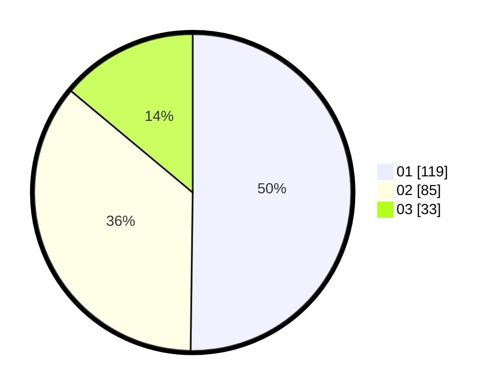

# Hasil

Hasil perolehan suara paslon dapat dilihat pada file paslon-01.txt, paslon-02.txt, dan paslon-03.txt.

Jika tidak ada, artinya data tersebut belum ada pada SIREKAP.

## Perolehan Suara

 * Paslon 01: **119**.
 * Paslon 02: **85**.
 * Paslon 03: **33**.

## Foto C Plano

https://sirekap-obj-formc.kpu.go.id/0fea/pemilu/ppwp/31/75/09/10/01/3175091001146-20240216-021320--57955987-c740-48cd-a908-3802ad435740.jpg

https://sirekap-obj-formc.kpu.go.id/0fea/pemilu/ppwp/31/75/09/10/01/3175091001146-20240216-084811--35dc3b6a-a486-457c-ad17-05a5c2c805b9.jpg

https://sirekap-obj-formc.kpu.go.id/0fea/pemilu/ppwp/31/75/09/10/01/3175091001146-20240216-021322--20e90c92-570d-4d8f-b216-8ea44bd84b3c.jpg

## DATA PEMILIH TETAP

Jumlah pemilih dalam DPT: **278**.
 * L: **135**.
 * P: **143**.

## DATA PENGGUNA HAK PILIH

Jumlah pengguna hak pilih dalam DPT: **240**.
 * L: **114**.
 * P: **126**.

Jumlah pengguna hak pilih dalam DPTb: **0**.
 * L: **0**.
 * P: **0**.

Jumlah pengguna hak pilih dalam DPK: **0**.
 * L: **0**.
 * P: **0**.

Jumlah pengguna hak pilih: **240**.
 * L: **114**.
 * P: **126**.

## JUMLAH SUARA SAH DAN TIDAK SAH

JUMLAH SELURUH SUARA SAH: **237**.

JUMLAH SUARA TIDAK SAH: **3**.

JUMLAH SELURUH SUARA SAH DAN SUARA TIDAK SAH: **240**.
