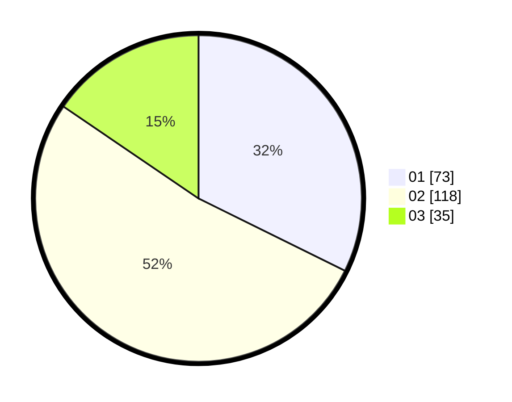

# Hasil

Hasil perolehan suara paslon dapat dilihat pada file paslon-01.txt, paslon-02.txt, dan paslon-03.txt.

Jika tidak ada, artinya data tersebut belum ada pada SIREKAP.

## Perolehan Suara

 * Paslon 01: **73**.
 * Paslon 02: **118**.
 * Paslon 03: **35**.

## Foto C Plano

https://sirekap-obj-formc.kpu.go.id/9add/pemilu/ppwp/31/75/09/10/01/3175091001147-20240216-181004--47066ac2-1960-4dd0-bf36-a162f3ae50e1.jpg

https://sirekap-obj-formc.kpu.go.id/9add/pemilu/ppwp/31/75/09/10/01/3175091001147-20240216-181106--cd38f4a9-ceac-4494-a1f0-10cd0ae02f7d.jpg

https://sirekap-obj-formc.kpu.go.id/9add/pemilu/ppwp/31/75/09/10/01/3175091001147-20240216-181754--db4b8fa0-0982-400d-ad31-4974214c73be.jpg

## DATA PEMILIH TETAP

Jumlah pemilih dalam DPT: **282**.
 * L: **138**.
 * P: **144**.

## DATA PENGGUNA HAK PILIH

Jumlah pengguna hak pilih dalam DPT: **228**.
 * L: **106**.
 * P: **122**.

Jumlah pengguna hak pilih dalam DPTb: **0**.
 * L: **0**.
 * P: **0**.

Jumlah pengguna hak pilih dalam DPK: **1**.
 * L: **0**.
 * P: **1**.

Jumlah pengguna hak pilih: **229**.
 * L: **106**.
 * P: **123**.

## JUMLAH SUARA SAH DAN TIDAK SAH

JUMLAH SELURUH SUARA SAH: **226**.

JUMLAH SUARA TIDAK SAH: **3**.

JUMLAH SELURUH SUARA SAH DAN SUARA TIDAK SAH: **229**.
