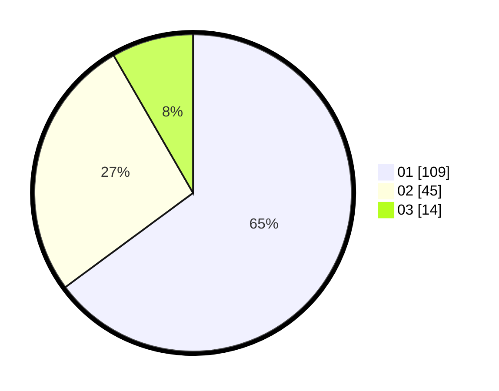

# Hasil

Hasil perolehan suara paslon dapat dilihat pada file paslon-01.txt, paslon-02.txt, dan paslon-03.txt.

Jika tidak ada, artinya data tersebut belum ada pada SIREKAP.

## Perolehan Suara

 * Paslon 01: **109**.
 * Paslon 02: **45**.
 * Paslon 03: **14**.

## Foto C Plano

https://sirekap-obj-formc.kpu.go.id/5d01/pemilu/ppwp/31/75/09/10/01/3175091001149-20240214-203321--253f258f-c533-45d0-bab8-974d75ce77ec.jpg

https://sirekap-obj-formc.kpu.go.id/5d01/pemilu/ppwp/31/75/09/10/01/3175091001149-20240214-192320--1b2e6d83-f3f8-45a3-96b6-a95b711b5ed1.jpg

https://sirekap-obj-formc.kpu.go.id/5d01/pemilu/ppwp/31/75/09/10/01/3175091001149-20240214-193249--72e06ed7-3c03-4da4-9df0-ec1ad4dbfe02.jpg

## DATA PEMILIH TETAP

Jumlah pemilih dalam DPT: **266**.
 * L: **137**.
 * P: **266**.

## DATA PENGGUNA HAK PILIH

Jumlah pengguna hak pilih dalam DPT: **215**.
 * L: **111**.
 * P: **104**.

Jumlah pengguna hak pilih dalam DPTb: **0**.
 * L: **0**.
 * P: **0**.

Jumlah pengguna hak pilih dalam DPK: **2**.
 * L: **1**.
 * P: **1**.

Jumlah pengguna hak pilih: **217**.
 * L: **112**.
 * P: **105**.

## JUMLAH SUARA SAH DAN TIDAK SAH

JUMLAH SELURUH SUARA SAH: **212**.

JUMLAH SUARA TIDAK SAH: **5**.

JUMLAH SELURUH SUARA SAH DAN SUARA TIDAK SAH: **217**.
