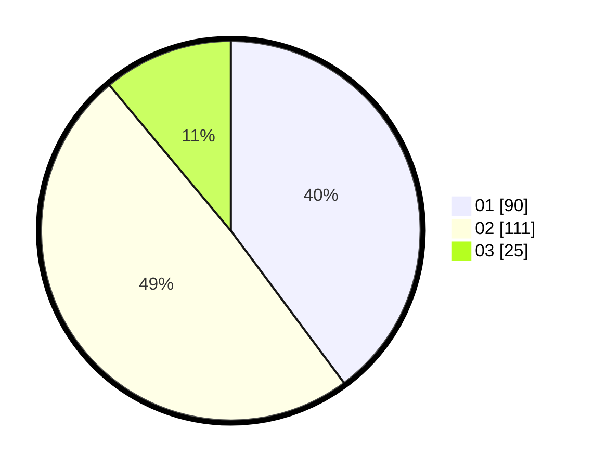

# Hasil

Hasil perolehan suara paslon dapat dilihat pada file paslon-01.txt, paslon-02.txt, dan paslon-03.txt.

Jika tidak ada, artinya data tersebut belum ada pada SIREKAP.

## Perolehan Suara

 * Paslon 01: **90**.
 * Paslon 02: **111**.
 * Paslon 03: **25**.

## Foto C Plano

https://sirekap-obj-formc.kpu.go.id/1a61/pemilu/ppwp/31/75/09/10/01/3175091001150-20240216-134900--6041aec3-57dc-429c-be58-1e712e6c62a7.jpg

https://sirekap-obj-formc.kpu.go.id/1a61/pemilu/ppwp/31/75/09/10/01/3175091001150-20240216-134901--97dba90a-8acf-43f4-9373-da26b99f4727.jpg

https://sirekap-obj-formc.kpu.go.id/1a61/pemilu/ppwp/31/75/09/10/01/3175091001150-20240216-134900--cf47a6ed-e8e5-4af7-a518-aefdc75ac79e.jpg

## DATA PEMILIH TETAP

Jumlah pemilih dalam DPT: **284**.
 * L: **138**.
 * P: **146**.

## DATA PENGGUNA HAK PILIH

Jumlah pengguna hak pilih dalam DPT: **229**.
 * L: **105**.
 * P: **124**.

Jumlah pengguna hak pilih dalam DPTb: **0**.
 * L: **0**.
 * P: **0**.

Jumlah pengguna hak pilih dalam DPK: **2**.
 * L: **1**.
 * P: **1**.

Jumlah pengguna hak pilih: **231**.
 * L: **106**.
 * P: **125**.

## JUMLAH SUARA SAH DAN TIDAK SAH

JUMLAH SELURUH SUARA SAH: **226**.

JUMLAH SUARA TIDAK SAH: **5**.

JUMLAH SELURUH SUARA SAH DAN SUARA TIDAK SAH: **231**.
