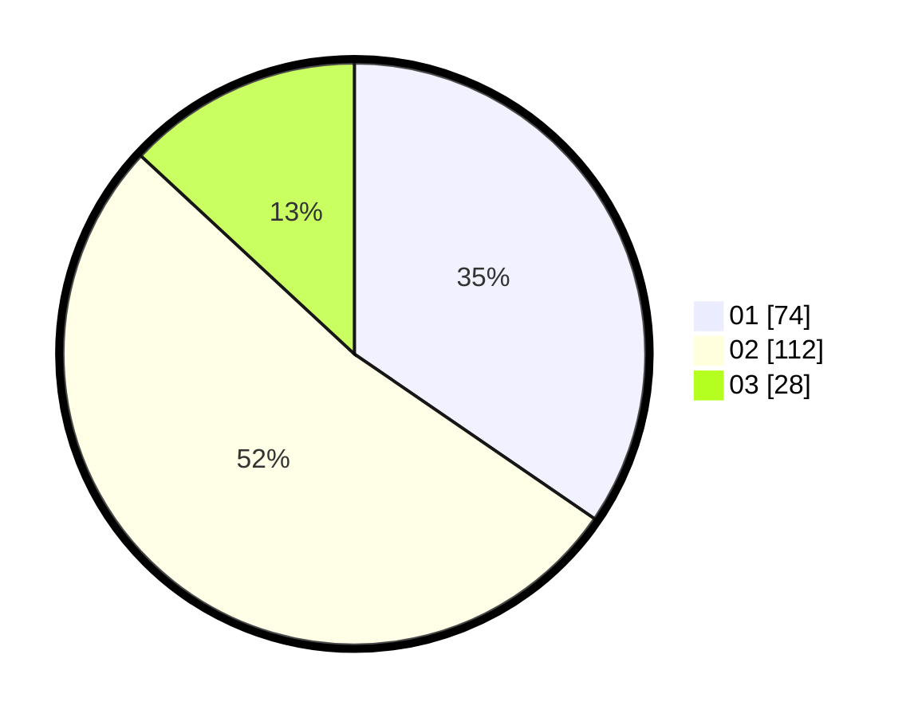

# Hasil

Hasil perolehan suara paslon dapat dilihat pada file paslon-01.txt, paslon-02.txt, dan paslon-03.txt.

Jika tidak ada, artinya data tersebut belum ada pada SIREKAP.

## Perolehan Suara

 * Paslon 01: **74**.
 * Paslon 02: **112**.
 * Paslon 03: **28**.

## Foto C Plano

https://sirekap-obj-formc.kpu.go.id/bbc4/pemilu/ppwp/31/75/09/10/01/3175091001152-20240219-191750--13173fb3-57ca-472a-9c6b-d7c34513f6f8.jpg

https://sirekap-obj-formc.kpu.go.id/bbc4/pemilu/ppwp/31/75/09/10/01/3175091001152-20240219-193020--827516b7-6050-4a1b-a4c6-508381d3bae0.jpg
