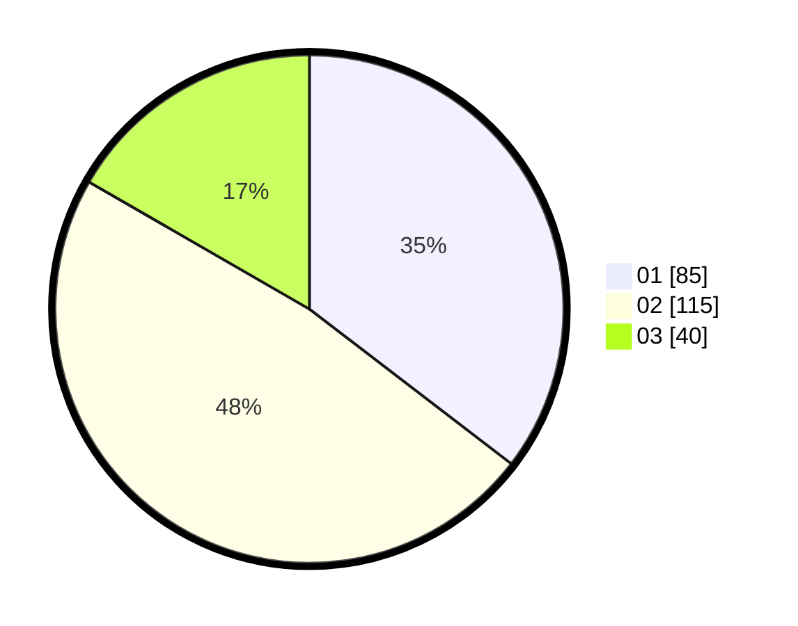

# Hasil

Hasil perolehan suara paslon dapat dilihat pada file paslon-01.txt, paslon-02.txt, dan paslon-03.txt.

Jika tidak ada, artinya data tersebut belum ada pada SIREKAP.

## Perolehan Suara

 * Paslon 01: **85**.
 * Paslon 02: **115**.
 * Paslon 03: **40**.

## Foto C Plano

https://sirekap-obj-formc.kpu.go.id/f08b/pemilu/ppwp/31/75/09/10/01/3175091001153-20240215-020000--530af84c-62a3-4de3-9e69-fc62911aa403.jpg

https://sirekap-obj-formc.kpu.go.id/f08b/pemilu/ppwp/31/75/09/10/01/3175091001153-20240215-020134--2180163e-5e84-45b7-bba9-dc0be3fe0153.jpg

https://sirekap-obj-formc.kpu.go.id/f08b/pemilu/ppwp/31/75/09/10/01/3175091001153-20240215-020221--e8b4fb99-ebf6-4ad9-bbde-7ad391be215b.jpg

## DATA PEMILIH TETAP

Jumlah pemilih dalam DPT: **275**.
 * L: **129**.
 * P: **146**.

## DATA PENGGUNA HAK PILIH

Jumlah pengguna hak pilih dalam DPT: **238**.
 * L: **111**.
 * P: **127**.

Jumlah pengguna hak pilih dalam DPTb: **0**.
 * L: **0**.
 * P: **0**.

Jumlah pengguna hak pilih dalam DPK: **2**.
 * L: **0**.
 * P: **2**.

Jumlah pengguna hak pilih: **240**.
 * L: **111**.
 * P: **129**.

## JUMLAH SUARA SAH DAN TIDAK SAH

JUMLAH SELURUH SUARA SAH: **240**.

JUMLAH SUARA TIDAK SAH: **0**.

JUMLAH SELURUH SUARA SAH DAN SUARA TIDAK SAH: **240**.
