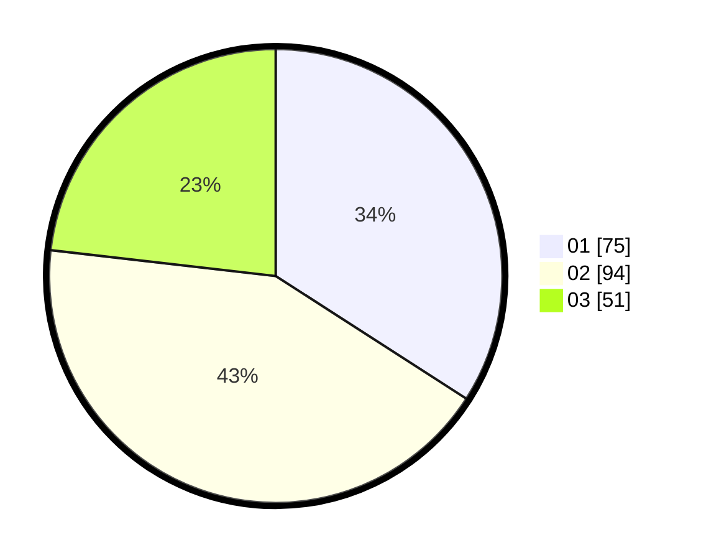

# Hasil

Hasil perolehan suara paslon dapat dilihat pada file paslon-01.txt, paslon-02.txt, dan paslon-03.txt.

Jika tidak ada, artinya data tersebut belum ada pada SIREKAP.

## Perolehan Suara

 * Paslon 01: **75**.
 * Paslon 02: **94**.
 * Paslon 03: **51**.

## Foto C Plano

https://sirekap-obj-formc.kpu.go.id/c251/pemilu/ppwp/31/75/09/10/01/3175091001154-20240217-111405--65bf9ecd-4bbd-4e26-9b8b-4e67c8886527.jpg

https://sirekap-obj-formc.kpu.go.id/c251/pemilu/ppwp/31/75/09/10/01/3175091001154-20240217-122952--e1ce7be0-e823-40c8-aa65-1602c8d979ec.jpg

https://sirekap-obj-formc.kpu.go.id/c251/pemilu/ppwp/31/75/09/10/01/3175091001154-20240217-123613--21508d49-850c-4562-9325-e7c6df85d8f0.jpg

## DATA PEMILIH TETAP

Jumlah pemilih dalam DPT: **273**.
 * L: **135**.
 * P: **138**.

## DATA PENGGUNA HAK PILIH

Jumlah pengguna hak pilih dalam DPT: **220**.
 * L: **111**.
 * P: **109**.

Jumlah pengguna hak pilih dalam DPTb: **0**.
 * L: **0**.
 * P: **0**.

Jumlah pengguna hak pilih dalam DPK: **0**.
 * L: **0**.
 * P: **0**.

Jumlah pengguna hak pilih: **220**.
 * L: **111**.
 * P: **109**.

## JUMLAH SUARA SAH DAN TIDAK SAH

JUMLAH SELURUH SUARA SAH: **220**.

JUMLAH SUARA TIDAK SAH: **0**.

JUMLAH SELURUH SUARA SAH DAN SUARA TIDAK SAH: **220**.
