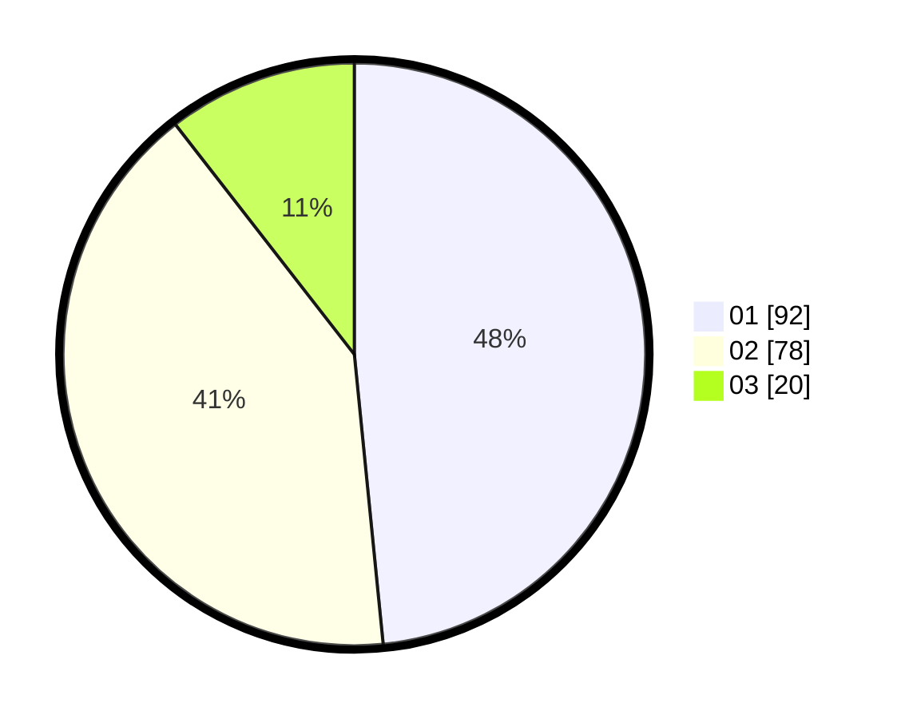

# Hasil

Hasil perolehan suara paslon dapat dilihat pada file paslon-01.txt, paslon-02.txt, dan paslon-03.txt.

Jika tidak ada, artinya data tersebut belum ada pada SIREKAP.

## Perolehan Suara

 * Paslon 01: **92**.
 * Paslon 02: **78**.
 * Paslon 03: **20**.

## Foto C Plano

https://sirekap-obj-formc.kpu.go.id/6524/pemilu/ppwp/31/75/09/10/01/3175091001161-20240214-185620--44f9bf12-0c6c-4657-a0c2-8908bd308164.jpg

https://sirekap-obj-formc.kpu.go.id/6524/pemilu/ppwp/31/75/09/10/01/3175091001161-20240214-190319--3cf73c76-b246-4504-9471-39eb88968453.jpg

https://sirekap-obj-formc.kpu.go.id/6524/pemilu/ppwp/31/75/09/10/01/3175091001161-20240214-185240--6abfa788-7391-49ef-a515-160c181454f1.jpg

## DATA PEMILIH TETAP

Jumlah pemilih dalam DPT: **262**.
 * L: **126**.
 * P: **136**.

## DATA PENGGUNA HAK PILIH

Jumlah pengguna hak pilih dalam DPT: **191**.
 * L: **88**.
 * P: **103**.

Jumlah pengguna hak pilih dalam DPTb: **1**.
 * L: **1**.
 * P: **0**.

Jumlah pengguna hak pilih dalam DPK: **4**.
 * L: **2**.
 * P: **2**.

Jumlah pengguna hak pilih: **196**.
 * L: **91**.
 * P: **105**.

## JUMLAH SUARA SAH DAN TIDAK SAH

JUMLAH SELURUH SUARA SAH: **190**.

JUMLAH SUARA TIDAK SAH: **6**.

JUMLAH SELURUH SUARA SAH DAN SUARA TIDAK SAH: **196**.
