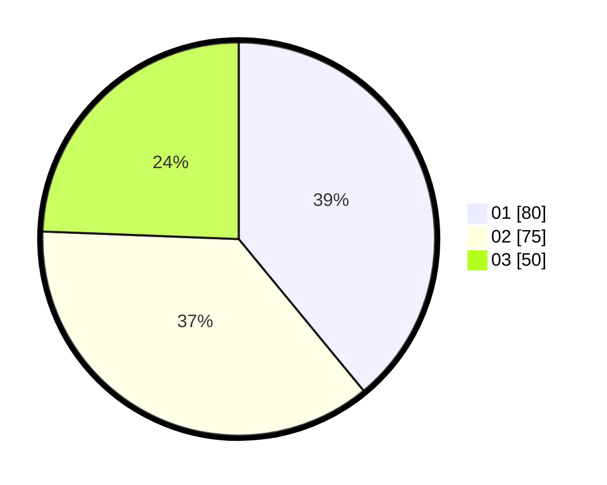

# Hasil

Hasil perolehan suara paslon dapat dilihat pada file paslon-01.txt, paslon-02.txt, dan paslon-03.txt.

Jika tidak ada, artinya data tersebut belum ada pada SIREKAP.

## Perolehan Suara

 * Paslon 01: **80**.
 * Paslon 02: **75**.
 * Paslon 03: **50**.

## Foto C Plano

https://sirekap-obj-formc.kpu.go.id/11bf/pemilu/ppwp/31/75/09/10/01/3175091001162-20240214-193453--3da5dba8-3dde-4b2b-ba8f-255f07f7ca46.jpg

https://sirekap-obj-formc.kpu.go.id/11bf/pemilu/ppwp/31/75/09/10/01/3175091001162-20240214-193456--0879ad0c-c64c-4c35-b9f2-5b5a2621ad29.jpg

https://sirekap-obj-formc.kpu.go.id/11bf/pemilu/ppwp/31/75/09/10/01/3175091001162-20240214-193459--033fd74b-6d24-46bd-9ac0-46d8cb90b5ca.jpg

## DATA PEMILIH TETAP

Jumlah pemilih dalam DPT: **257**.
 * L: **134**.
 * P: **123**.

## DATA PENGGUNA HAK PILIH

Jumlah pengguna hak pilih dalam DPT: **202**.
 * L: **101**.
 * P: **101**.

Jumlah pengguna hak pilih dalam DPTb: **5**.
 * L: **2**.
 * P: **3**.

Jumlah pengguna hak pilih dalam DPK: **1**.
 * L: **0**.
 * P: **1**.

Jumlah pengguna hak pilih: **208**.
 * L: **103**.
 * P: **105**.

## JUMLAH SUARA SAH DAN TIDAK SAH

JUMLAH SELURUH SUARA SAH: **205**.

JUMLAH SUARA TIDAK SAH: **3**.

JUMLAH SELURUH SUARA SAH DAN SUARA TIDAK SAH: **208**.
