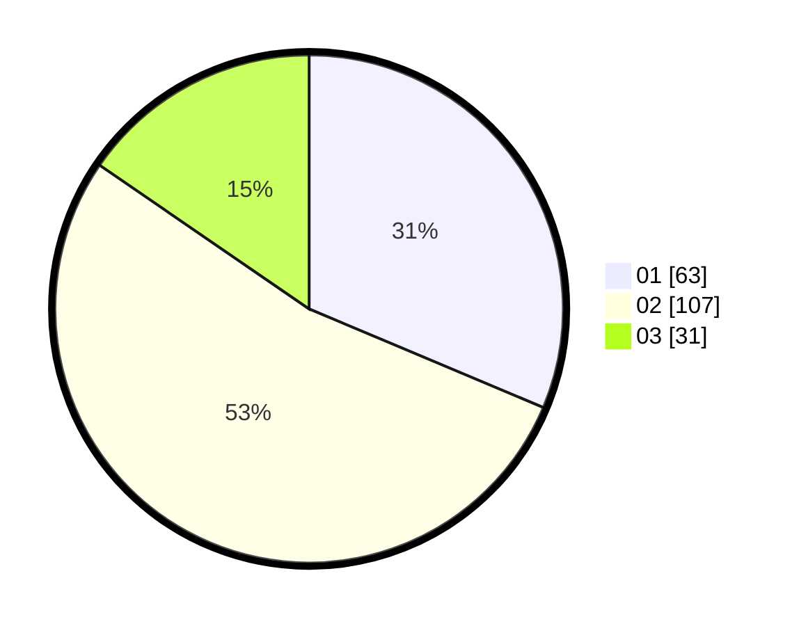

# Hasil

Hasil perolehan suara paslon dapat dilihat pada file paslon-01.txt, paslon-02.txt, dan paslon-03.txt.

Jika tidak ada, artinya data tersebut belum ada pada SIREKAP.

## Perolehan Suara

 * Paslon 01: **63**.
 * Paslon 02: **107**.
 * Paslon 03: **31**.

## Foto C Plano

https://sirekap-obj-formc.kpu.go.id/d22b/pemilu/ppwp/31/75/09/10/01/3175091001176-20240215-170632--5ba5c514-9079-4155-9e28-b1c6b4d51eeb.jpg

https://sirekap-obj-formc.kpu.go.id/d22b/pemilu/ppwp/31/75/09/10/01/3175091001176-20240214-193843--5e046470-185c-4577-a653-7e0fb828191c.jpg

https://sirekap-obj-formc.kpu.go.id/d22b/pemilu/ppwp/31/75/09/10/01/3175091001176-20240214-193847--f13ad903-10e4-454c-ab65-3c1fb5ef98b3.jpg
