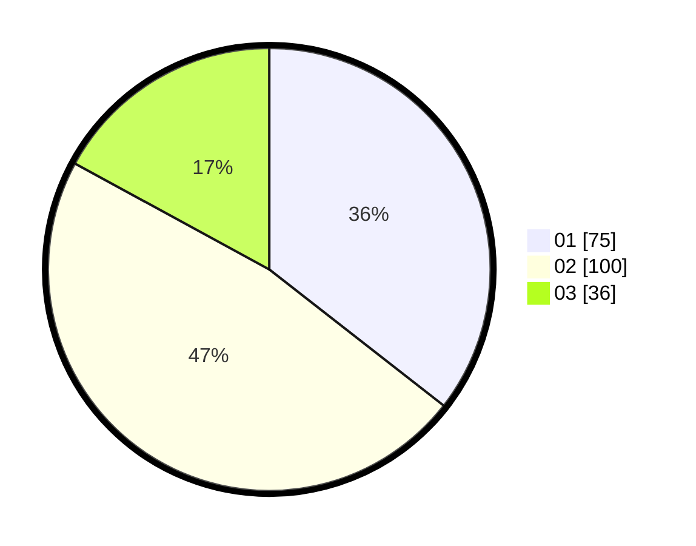

# Hasil

Hasil perolehan suara paslon dapat dilihat pada file paslon-01.txt, paslon-02.txt, dan paslon-03.txt.

Jika tidak ada, artinya data tersebut belum ada pada SIREKAP.

## Perolehan Suara

 * Paslon 01: **75**.
 * Paslon 02: **100**.
 * Paslon 03: **36**.

## Foto C Plano

https://sirekap-obj-formc.kpu.go.id/420b/pemilu/ppwp/31/75/09/10/01/3175091001183-20240216-145348--23df5882-c7f0-468f-81c5-04a6b433a23b.jpg

https://sirekap-obj-formc.kpu.go.id/420b/pemilu/ppwp/31/75/09/10/01/3175091001183-20240216-010731--187e1973-3e60-4454-aa9a-a4359138935f.jpg

https://sirekap-obj-formc.kpu.go.id/420b/pemilu/ppwp/31/75/09/10/01/3175091001183-20240216-145349--9b48b179-ed9c-45a0-867c-16ee8e54bea4.jpg

## DATA PEMILIH TETAP

Jumlah pemilih dalam DPT: **287**.
 * L: **145**.
 * P: **142**.

## DATA PENGGUNA HAK PILIH

Jumlah pengguna hak pilih dalam DPT: **216**.
 * L: **105**.
 * P: **111**.

Jumlah pengguna hak pilih dalam DPTb: **0**.
 * L: **0**.
 * P: **0**.

Jumlah pengguna hak pilih dalam DPK: **0**.
 * L: **0**.
 * P: **0**.

Jumlah pengguna hak pilih: **216**.
 * L: **105**.
 * P: **111**.

## JUMLAH SUARA SAH DAN TIDAK SAH

JUMLAH SELURUH SUARA SAH: **211**.

JUMLAH SUARA TIDAK SAH: **5**.

JUMLAH SELURUH SUARA SAH DAN SUARA TIDAK SAH: **216**.
