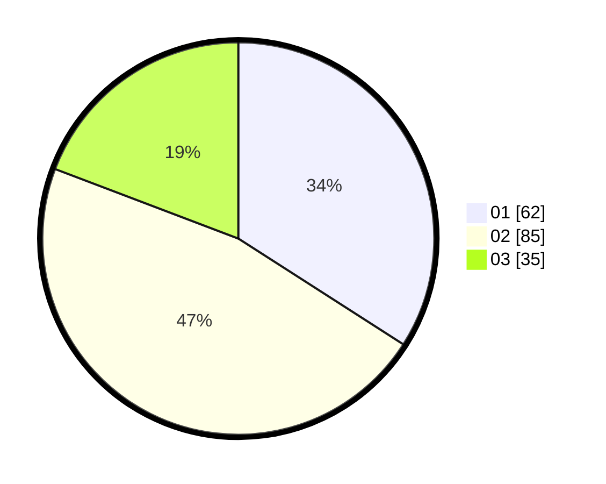

# Hasil

Hasil perolehan suara paslon dapat dilihat pada file paslon-01.txt, paslon-02.txt, dan paslon-03.txt.

Jika tidak ada, artinya data tersebut belum ada pada SIREKAP.

## Perolehan Suara

 * Paslon 01: **62**.
 * Paslon 02: **85**.
 * Paslon 03: **35**.

## Foto C Plano

https://sirekap-obj-formc.kpu.go.id/64e6/pemilu/ppwp/31/75/09/10/01/3175091001185-20240216-150222--928c2689-a5f7-41b0-942c-fc20b32de749.jpg

https://sirekap-obj-formc.kpu.go.id/64e6/pemilu/ppwp/31/75/09/10/01/3175091001185-20240216-150224--0697df4b-3bb6-44b1-a4f7-0f1a1bcc6993.jpg

https://sirekap-obj-formc.kpu.go.id/64e6/pemilu/ppwp/31/75/09/10/01/3175091001185-20240216-150223--64483685-81e1-49b2-acda-c12ccaa41598.jpg

## DATA PEMILIH TETAP

Jumlah pemilih dalam DPT: **250**.
 * L: **129**.
 * P: **121**.

## DATA PENGGUNA HAK PILIH

Jumlah pengguna hak pilih dalam DPT: **183**.
 * L: **86**.
 * P: **97**.

Jumlah pengguna hak pilih dalam DPTb: **0**.
 * L: **0**.
 * P: **0**.

Jumlah pengguna hak pilih dalam DPK: **0**.
 * L: **0**.
 * P: **0**.

Jumlah pengguna hak pilih: **183**.
 * L: **86**.
 * P: **97**.

## JUMLAH SUARA SAH DAN TIDAK SAH

JUMLAH SELURUH SUARA SAH: **182**.

JUMLAH SUARA TIDAK SAH: **1**.

JUMLAH SELURUH SUARA SAH DAN SUARA TIDAK SAH: **183**.
