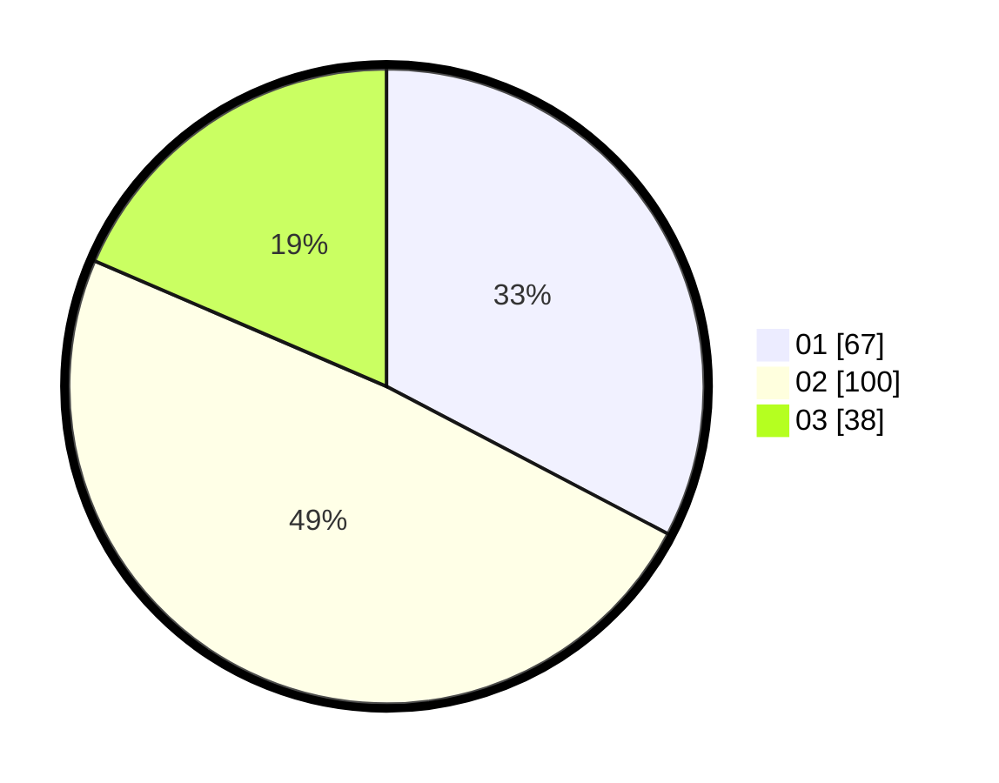

# Hasil

Hasil perolehan suara paslon dapat dilihat pada file paslon-01.txt, paslon-02.txt, dan paslon-03.txt.

Jika tidak ada, artinya data tersebut belum ada pada SIREKAP.

## Perolehan Suara

 * Paslon 01: **67**.
 * Paslon 02: **100**.
 * Paslon 03: **38**.

## Foto C Plano

https://sirekap-obj-formc.kpu.go.id/f4eb/pemilu/ppwp/31/75/09/10/01/3175091001187-20240215-043526--bf7ebd55-b5b9-4b26-bfd2-ea54588673f5.jpg

https://sirekap-obj-formc.kpu.go.id/f4eb/pemilu/ppwp/31/75/09/10/01/3175091001187-20240215-043613--8b75b98b-7466-45ff-9f59-c9372c0f6545.jpg

https://sirekap-obj-formc.kpu.go.id/f4eb/pemilu/ppwp/31/75/09/10/01/3175091001187-20240215-043655--1053bb7c-7222-4db8-8f18-1bac6ceef456.jpg

## DATA PEMILIH TETAP

Jumlah pemilih dalam DPT: **251**.
 * L: **117**.
 * P: **134**.

## DATA PENGGUNA HAK PILIH

Jumlah pengguna hak pilih dalam DPT: **211**.
 * L: **95**.
 * P: **116**.

Jumlah pengguna hak pilih dalam DPTb: **0**.
 * L: **0**.
 * P: **0**.

Jumlah pengguna hak pilih dalam DPK: **0**.
 * L: **0**.
 * P: **0**.

Jumlah pengguna hak pilih: **211**.
 * L: **95**.
 * P: **116**.

## JUMLAH SUARA SAH DAN TIDAK SAH

JUMLAH SELURUH SUARA SAH: **205**.

JUMLAH SUARA TIDAK SAH: **6**.

JUMLAH SELURUH SUARA SAH DAN SUARA TIDAK SAH: **211**.
