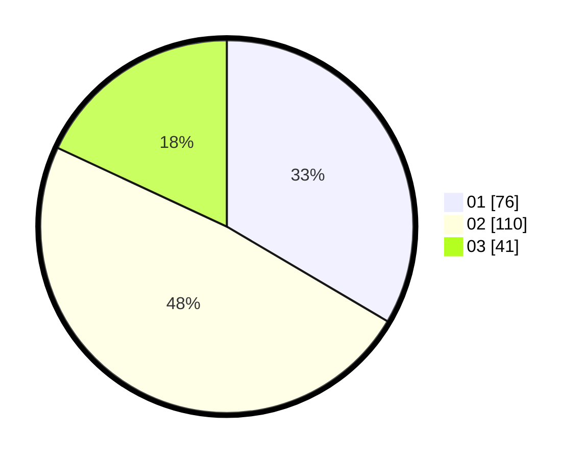

# Hasil

Hasil perolehan suara paslon dapat dilihat pada file paslon-01.txt, paslon-02.txt, dan paslon-03.txt.

Jika tidak ada, artinya data tersebut belum ada pada SIREKAP.

## Perolehan Suara

 * Paslon 01: **76**.
 * Paslon 02: **110**.
 * Paslon 03: **41**.

## Foto C Plano

https://sirekap-obj-formc.kpu.go.id/f70a/pemilu/ppwp/31/75/09/10/01/3175091001192-20240217-022654--66476910-7350-483a-88da-8233ef257048.jpg

https://sirekap-obj-formc.kpu.go.id/f70a/pemilu/ppwp/31/75/09/10/01/3175091001192-20240216-212658--1c8d3606-da49-4a39-b041-c5579128b070.jpg

https://sirekap-obj-formc.kpu.go.id/f70a/pemilu/ppwp/31/75/09/10/01/3175091001192-20240216-213145--ae4a703a-60c3-490e-bd38-31427ac1fb5d.jpg
