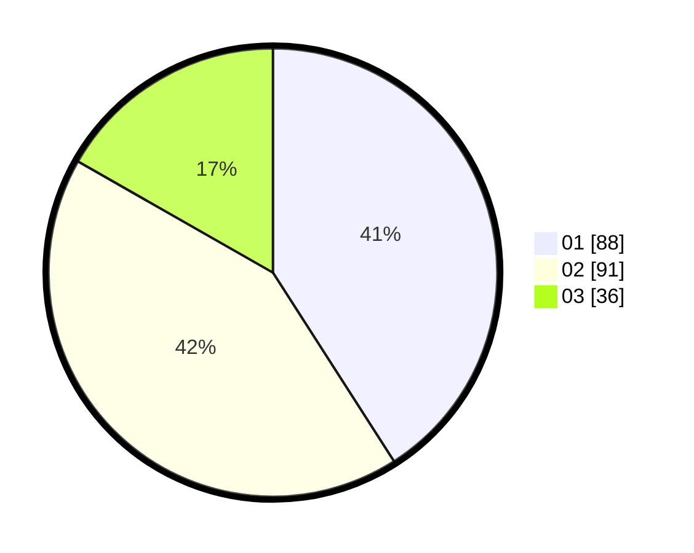

# Hasil

Hasil perolehan suara paslon dapat dilihat pada file paslon-01.txt, paslon-02.txt, dan paslon-03.txt.

Jika tidak ada, artinya data tersebut belum ada pada SIREKAP.

## Perolehan Suara

 * Paslon 01: **88**.
 * Paslon 02: **91**.
 * Paslon 03: **36**.

## Foto C Plano

https://sirekap-obj-formc.kpu.go.id/da2b/pemilu/ppwp/31/75/09/10/01/3175091001193-20240216-180447--804dbd5e-96fd-4d37-8649-8f46a381746d.jpg

https://sirekap-obj-formc.kpu.go.id/da2b/pemilu/ppwp/31/75/09/10/01/3175091001193-20240216-180627--710033b7-6ee8-4094-9d4a-582fec31b70f.jpg

https://sirekap-obj-formc.kpu.go.id/da2b/pemilu/ppwp/31/75/09/10/01/3175091001193-20240214-195706--5bcc2740-af6b-40fd-9a05-f0b1c5ed7ef1.jpg

## DATA PEMILIH TETAP

Jumlah pemilih dalam DPT: **294**.
 * L: **146**.
 * P: **148**.

## DATA PENGGUNA HAK PILIH

Jumlah pengguna hak pilih dalam DPT: **220**.
 * L: **101**.
 * P: **119**.

Jumlah pengguna hak pilih dalam DPTb: **0**.
 * L: **0**.
 * P: **0**.

Jumlah pengguna hak pilih dalam DPK: **0**.
 * L: **0**.
 * P: **0**.

Jumlah pengguna hak pilih: **220**.
 * L: **101**.
 * P: **119**.

## JUMLAH SUARA SAH DAN TIDAK SAH

JUMLAH SELURUH SUARA SAH: **215**.

JUMLAH SUARA TIDAK SAH: **5**.

JUMLAH SELURUH SUARA SAH DAN SUARA TIDAK SAH: **220**.
