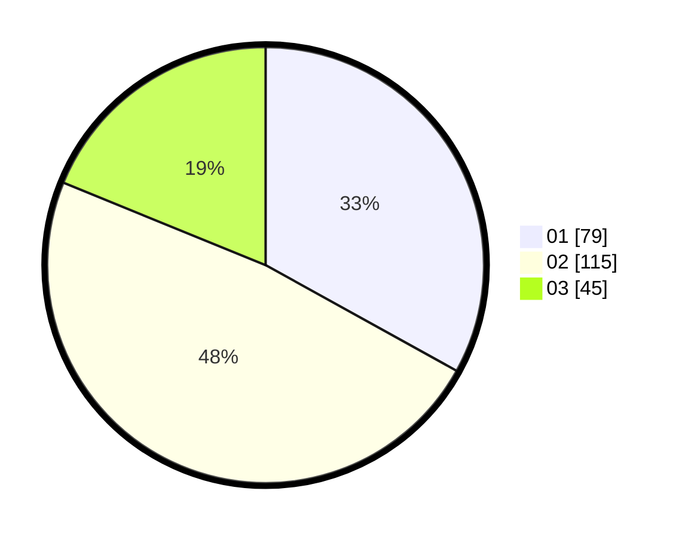

# Hasil

Hasil perolehan suara paslon dapat dilihat pada file paslon-01.txt, paslon-02.txt, dan paslon-03.txt.

Jika tidak ada, artinya data tersebut belum ada pada SIREKAP.

## Perolehan Suara

 * Paslon 01: **79**.
 * Paslon 02: **115**.
 * Paslon 03: **45**.

## Foto C Plano

https://sirekap-obj-formc.kpu.go.id/3902/pemilu/ppwp/31/75/09/10/01/3175091001194-20240214-233828--6bf215a8-e8f0-4b20-8d43-ec54e2e4eef5.jpg

https://sirekap-obj-formc.kpu.go.id/3902/pemilu/ppwp/31/75/09/10/01/3175091001194-20240218-010627--53b2f587-ae5f-47c3-a997-6f94ca5860b8.jpg

https://sirekap-obj-formc.kpu.go.id/3902/pemilu/ppwp/31/75/09/10/01/3175091001194-20240218-010627--e97e993f-45a1-4e40-806f-ec388773a9de.jpg

## DATA PEMILIH TETAP

Jumlah pemilih dalam DPT: **277**.
 * L: **126**.
 * P: **151**.

## DATA PENGGUNA HAK PILIH

Jumlah pengguna hak pilih dalam DPT: **238**.
 * L: **105**.
 * P: **133**.

Jumlah pengguna hak pilih dalam DPTb: **0**.
 * L: **0**.
 * P: **0**.

Jumlah pengguna hak pilih dalam DPK: **3**.
 * L: **1**.
 * P: **2**.

Jumlah pengguna hak pilih: **241**.
 * L: **106**.
 * P: **135**.

## JUMLAH SUARA SAH DAN TIDAK SAH

JUMLAH SELURUH SUARA SAH: **239**.

JUMLAH SUARA TIDAK SAH: **2**.

JUMLAH SELURUH SUARA SAH DAN SUARA TIDAK SAH: **241**.
