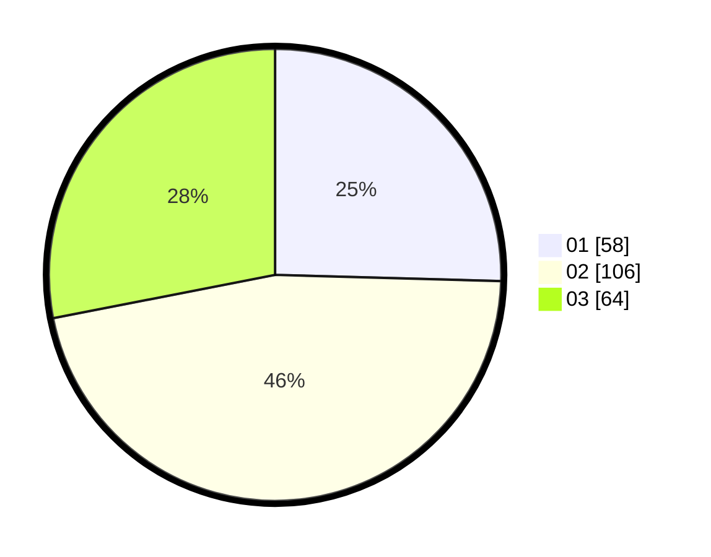

# Hasil

Hasil perolehan suara paslon dapat dilihat pada file paslon-01.txt, paslon-02.txt, dan paslon-03.txt.

Jika tidak ada, artinya data tersebut belum ada pada SIREKAP.

## Perolehan Suara

 * Paslon 01: **58**.
 * Paslon 02: **106**.
 * Paslon 03: **64**.

## Foto C Plano

https://sirekap-obj-formc.kpu.go.id/bff5/pemilu/ppwp/31/75/09/10/01/3175091001195-20240216-211325--2194fe38-b556-419f-93c4-fbfe7af9015a.jpg

https://sirekap-obj-formc.kpu.go.id/bff5/pemilu/ppwp/31/75/09/10/01/3175091001195-20240217-212747--386b9816-c648-424e-8225-49275decc524.jpg

https://sirekap-obj-formc.kpu.go.id/bff5/pemilu/ppwp/31/75/09/10/01/3175091001195-20240217-212747--f98d3c72-d50e-4183-9eba-6f255d31d0ae.jpg

## DATA PEMILIH TETAP

Jumlah pemilih dalam DPT: **273**.
 * L: **137**.
 * P: **136**.

## DATA PENGGUNA HAK PILIH

Jumlah pengguna hak pilih dalam DPT: **228**.
 * L: **105**.
 * P: **123**.

Jumlah pengguna hak pilih dalam DPTb: **0**.
 * L: **0**.
 * P: **0**.

Jumlah pengguna hak pilih dalam DPK: **2**.
 * L: **0**.
 * P: **2**.

Jumlah pengguna hak pilih: **230**.
 * L: **105**.
 * P: **125**.

## JUMLAH SUARA SAH DAN TIDAK SAH

JUMLAH SELURUH SUARA SAH: **228**.

JUMLAH SUARA TIDAK SAH: **2**.

JUMLAH SELURUH SUARA SAH DAN SUARA TIDAK SAH: **230**.
