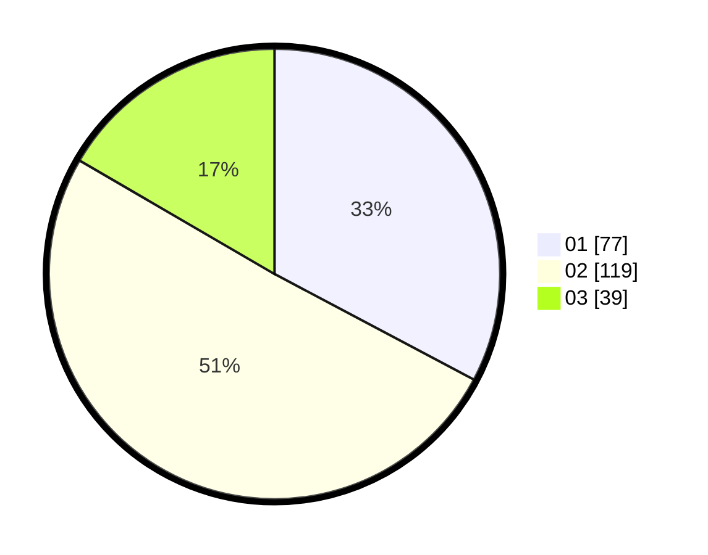

# Hasil

Hasil perolehan suara paslon dapat dilihat pada file paslon-01.txt, paslon-02.txt, dan paslon-03.txt.

Jika tidak ada, artinya data tersebut belum ada pada SIREKAP.

## Perolehan Suara

 * Paslon 01: **77**.
 * Paslon 02: **119**.
 * Paslon 03: **39**.

## Foto C Plano

https://sirekap-obj-formc.kpu.go.id/4cf5/pemilu/ppwp/31/75/09/10/01/3175091001197-20240214-204040--3117d6c2-657a-497a-9c5a-f6b6c27ea91c.jpg

https://sirekap-obj-formc.kpu.go.id/4cf5/pemilu/ppwp/31/75/09/10/01/3175091001197-20240214-205458--90b89ab3-41ed-41c6-a095-fc4f8cc5e10c.jpg

https://sirekap-obj-formc.kpu.go.id/4cf5/pemilu/ppwp/31/75/09/10/01/3175091001197-20240214-205614--ed58c095-3cf6-4f3e-af51-7e8adf33c5ae.jpg

## DATA PEMILIH TETAP

Jumlah pemilih dalam DPT: **291**.
 * L: **138**.
 * P: **153**.

## DATA PENGGUNA HAK PILIH

Jumlah pengguna hak pilih dalam DPT: **236**.
 * L: **112**.
 * P: **124**.

Jumlah pengguna hak pilih dalam DPTb: **1**.
 * L: **0**.
 * P: **1**.

Jumlah pengguna hak pilih dalam DPK: **2**.
 * L: **1**.
 * P: **1**.

Jumlah pengguna hak pilih: **239**.
 * L: **113**.
 * P: **126**.

## JUMLAH SUARA SAH DAN TIDAK SAH

JUMLAH SELURUH SUARA SAH: **235**.

JUMLAH SUARA TIDAK SAH: **4**.

JUMLAH SELURUH SUARA SAH DAN SUARA TIDAK SAH: **239**.
