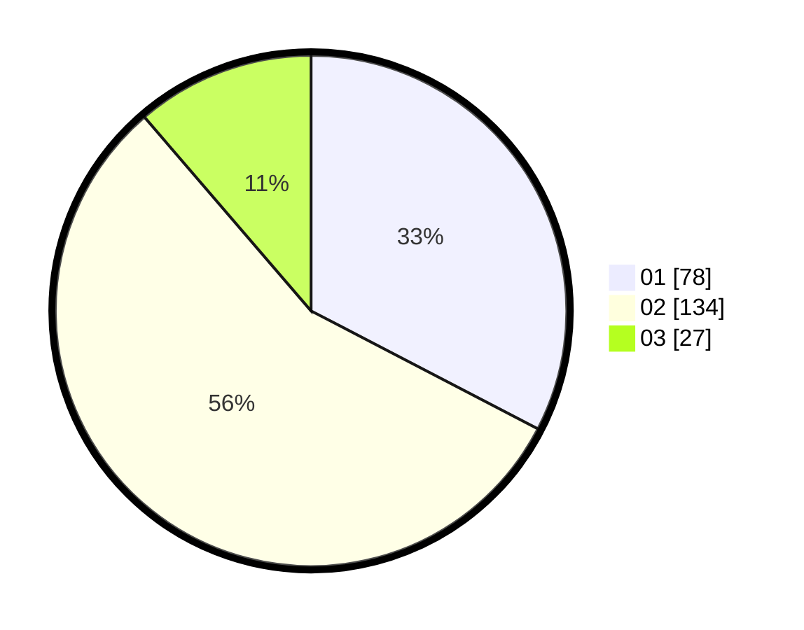

# Hasil

Hasil perolehan suara paslon dapat dilihat pada file paslon-01.txt, paslon-02.txt, dan paslon-03.txt.

Jika tidak ada, artinya data tersebut belum ada pada SIREKAP.

## Perolehan Suara

 * Paslon 01: **78**.
 * Paslon 02: **134**.
 * Paslon 03: **27**.

## Foto C Plano

https://sirekap-obj-formc.kpu.go.id/57c5/pemilu/ppwp/31/75/09/10/01/3175091001198-20240215-233146--a936c5c6-fa66-43fd-a239-1a136d5ea835.jpg

https://sirekap-obj-formc.kpu.go.id/57c5/pemilu/ppwp/31/75/09/10/01/3175091001198-20240215-233151--41728783-944f-44f0-9f46-71fb9f9e9b6a.jpg

https://sirekap-obj-formc.kpu.go.id/57c5/pemilu/ppwp/31/75/09/10/01/3175091001198-20240215-233148--1d74661e-bcd9-4029-810a-53c7987ef914.jpg

## DATA PEMILIH TETAP

Jumlah pemilih dalam DPT: **290**.
 * L: **129**.
 * P: **161**.

## DATA PENGGUNA HAK PILIH

Jumlah pengguna hak pilih dalam DPT: **241**.
 * L: **104**.
 * P: **137**.

Jumlah pengguna hak pilih dalam DPTb: **0**.
 * L: **0**.
 * P: **0**.

Jumlah pengguna hak pilih dalam DPK: **0**.
 * L: **0**.
 * P: **0**.

Jumlah pengguna hak pilih: **241**.
 * L: **104**.
 * P: **137**.

## JUMLAH SUARA SAH DAN TIDAK SAH

JUMLAH SELURUH SUARA SAH: **239**.

JUMLAH SUARA TIDAK SAH: **2**.

JUMLAH SELURUH SUARA SAH DAN SUARA TIDAK SAH: **241**.
