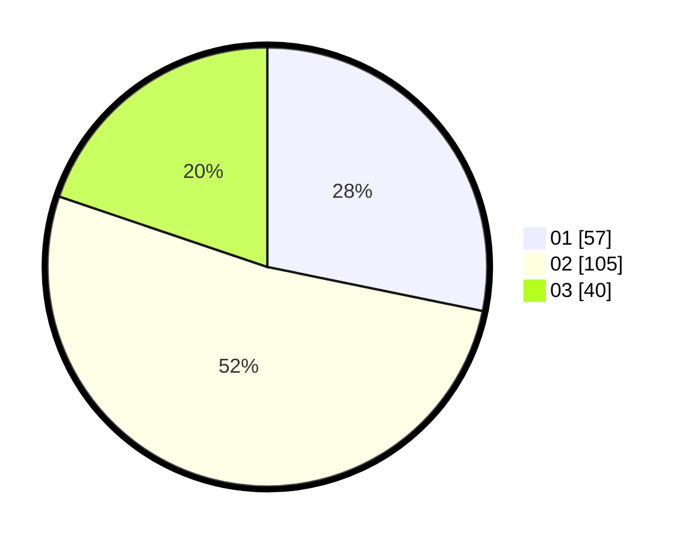

# Hasil

Hasil perolehan suara paslon dapat dilihat pada file paslon-01.txt, paslon-02.txt, dan paslon-03.txt.

Jika tidak ada, artinya data tersebut belum ada pada SIREKAP.

## Perolehan Suara

 * Paslon 01: **57**.
 * Paslon 02: **105**.
 * Paslon 03: **40**.

## Foto C Plano

https://sirekap-obj-formc.kpu.go.id/be4f/pemilu/ppwp/31/75/09/10/01/3175091001200-20240216-123835--e9935232-b1fd-4b86-aec5-f10e66d18a5f.jpg

https://sirekap-obj-formc.kpu.go.id/be4f/pemilu/ppwp/31/75/09/10/01/3175091001200-20240214-213823--0768bfea-4a6a-4741-a0ee-e7e78c89b0a1.jpg

https://sirekap-obj-formc.kpu.go.id/be4f/pemilu/ppwp/31/75/09/10/01/3175091001200-20240214-213708--73442e83-76e7-4969-a450-1fe852141f7e.jpg

## DATA PEMILIH TETAP

Jumlah pemilih dalam DPT: **276**.
 * L: **135**.
 * P: **141**.

## DATA PENGGUNA HAK PILIH

Jumlah pengguna hak pilih dalam DPT: **206**.
 * L: **97**.
 * P: **109**.

Jumlah pengguna hak pilih dalam DPTb: **2**.
 * L: **1**.
 * P: **1**.

Jumlah pengguna hak pilih dalam DPK: **1**.
 * L: **1**.
 * P: **0**.

Jumlah pengguna hak pilih: **209**.
 * L: **99**.
 * P: **110**.

## JUMLAH SUARA SAH DAN TIDAK SAH

JUMLAH SELURUH SUARA SAH: **203**.

JUMLAH SUARA TIDAK SAH: **6**.

JUMLAH SELURUH SUARA SAH DAN SUARA TIDAK SAH: **209**.
