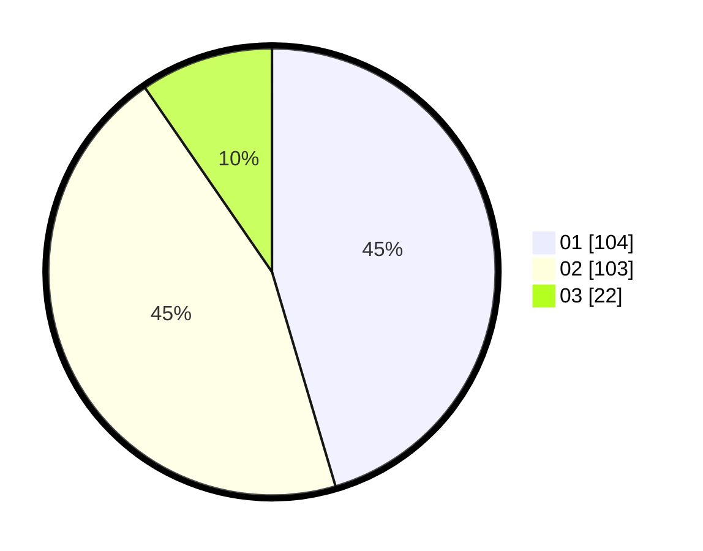

# Hasil

Hasil perolehan suara paslon dapat dilihat pada file paslon-01.txt, paslon-02.txt, dan paslon-03.txt.

Jika tidak ada, artinya data tersebut belum ada pada SIREKAP.

## Perolehan Suara

 * Paslon 01: **104**.
 * Paslon 02: **103**.
 * Paslon 03: **22**.

## Foto C Plano

https://sirekap-obj-formc.kpu.go.id/9611/pemilu/ppwp/31/75/09/10/01/3175091001204-20240214-210203--dc8b533a-79c3-449c-ba86-85936bf13a1c.jpg

https://sirekap-obj-formc.kpu.go.id/9611/pemilu/ppwp/31/75/09/10/01/3175091001204-20240214-222033--3f683634-c2f0-456d-9303-62b0af40af68.jpg

https://sirekap-obj-formc.kpu.go.id/9611/pemilu/ppwp/31/75/09/10/01/3175091001204-20240214-222228--3be5eb21-26bc-45b8-999e-5d8b5e66bae9.jpg

## DATA PEMILIH TETAP

Jumlah pemilih dalam DPT: **279**.
 * L: **141**.
 * P: **138**.

## DATA PENGGUNA HAK PILIH

Jumlah pengguna hak pilih dalam DPT: **229**.
 * L: **114**.
 * P: **115**.

Jumlah pengguna hak pilih dalam DPTb: **2**.
 * L: **1**.
 * P: **1**.

Jumlah pengguna hak pilih dalam DPK: **0**.
 * L: **0**.
 * P: **0**.

Jumlah pengguna hak pilih: **231**.
 * L: **115**.
 * P: **116**.

## JUMLAH SUARA SAH DAN TIDAK SAH

JUMLAH SELURUH SUARA SAH: **229**.

JUMLAH SUARA TIDAK SAH: **2**.

JUMLAH SELURUH SUARA SAH DAN SUARA TIDAK SAH: **231**.
