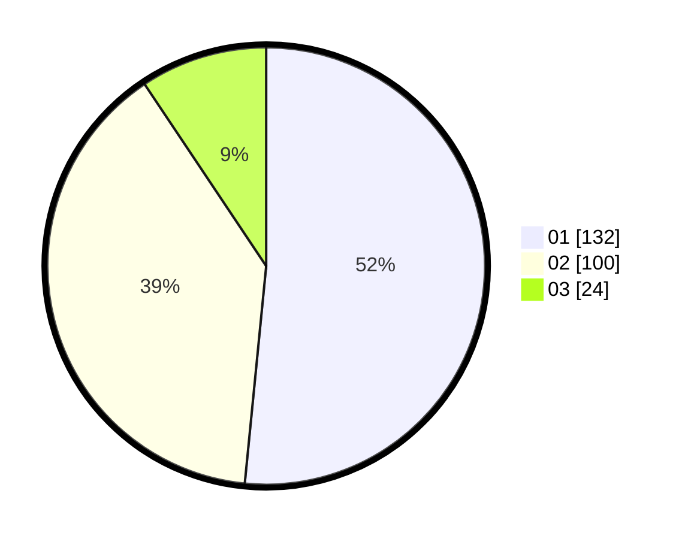

# Hasil

Hasil perolehan suara paslon dapat dilihat pada file paslon-01.txt, paslon-02.txt, dan paslon-03.txt.

Jika tidak ada, artinya data tersebut belum ada pada SIREKAP.

## Perolehan Suara

 * Paslon 01: **132**.
 * Paslon 02: **100**.
 * Paslon 03: **24**.

## Foto C Plano

https://sirekap-obj-formc.kpu.go.id/d373/pemilu/ppwp/31/75/09/10/01/3175091001211-20240214-185326--84a971ca-3dc1-4dbe-b111-562edd6cca3f.jpg

https://sirekap-obj-formc.kpu.go.id/d373/pemilu/ppwp/31/75/09/10/01/3175091001211-20240214-204043--a38a66e5-e762-46ff-a475-00384a53056a.jpg

https://sirekap-obj-formc.kpu.go.id/d373/pemilu/ppwp/31/75/09/10/01/3175091001211-20240214-192540--a32302cc-e1a5-4ac8-9cc8-b9e08cc49237.jpg

## DATA PEMILIH TETAP

Jumlah pemilih dalam DPT: **296**.
 * L: **146**.
 * P: **150**.

## DATA PENGGUNA HAK PILIH

Jumlah pengguna hak pilih dalam DPT: **261**.
 * L: **128**.
 * P: **133**.

Jumlah pengguna hak pilih dalam DPTb: **2**.
 * L: **1**.
 * P: **1**.

Jumlah pengguna hak pilih dalam DPK: **0**.
 * L: **0**.
 * P: **0**.

Jumlah pengguna hak pilih: **263**.
 * L: **129**.
 * P: **134**.

## JUMLAH SUARA SAH DAN TIDAK SAH

JUMLAH SELURUH SUARA SAH: **256**.

JUMLAH SUARA TIDAK SAH: **7**.

JUMLAH SELURUH SUARA SAH DAN SUARA TIDAK SAH: **263**.
