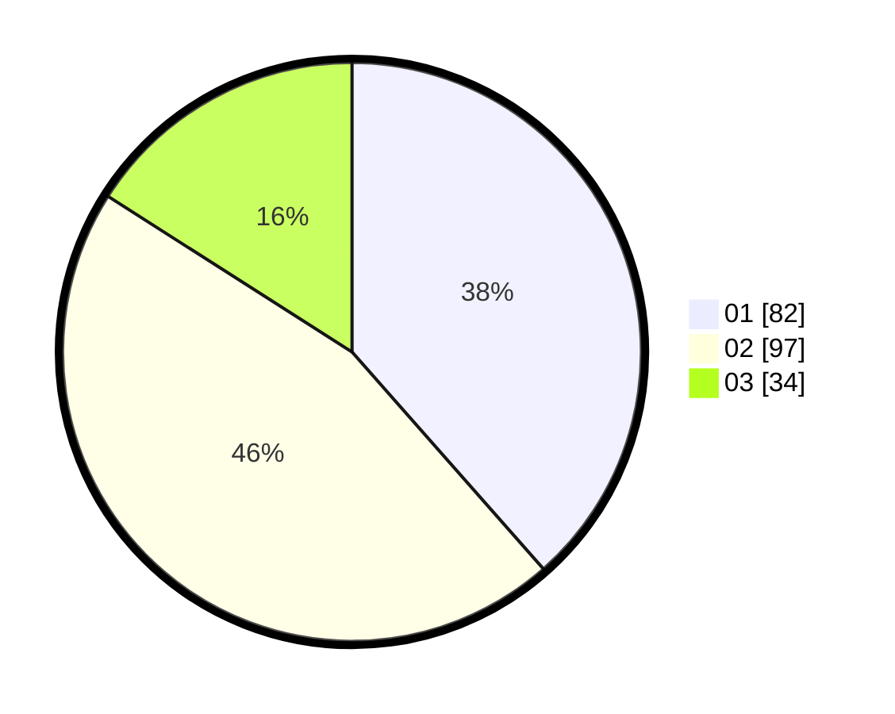

# Hasil

Hasil perolehan suara paslon dapat dilihat pada file paslon-01.txt, paslon-02.txt, dan paslon-03.txt.

Jika tidak ada, artinya data tersebut belum ada pada SIREKAP.

## Perolehan Suara

 * Paslon 01: **82**.
 * Paslon 02: **97**.
 * Paslon 03: **34**.

## Foto C Plano

https://sirekap-obj-formc.kpu.go.id/8c11/pemilu/ppwp/31/75/09/10/01/3175091001214-20240218-170836--6949cc6e-f022-4608-8a38-c75034fda593.jpg

https://sirekap-obj-formc.kpu.go.id/8c11/pemilu/ppwp/31/75/09/10/01/3175091001214-20240218-171754--5b79259b-9093-443e-9716-b126773eb76f.jpg

https://sirekap-obj-formc.kpu.go.id/8c11/pemilu/ppwp/31/75/09/10/01/3175091001214-20240218-171250--d6363dcd-7d80-422f-ab5e-123b21d998db.jpg

## DATA PEMILIH TETAP

Jumlah pemilih dalam DPT: **284**.
 * L: **135**.
 * P: **199**.

## DATA PENGGUNA HAK PILIH

Jumlah pengguna hak pilih dalam DPT: **215**.
 * L: **98**.
 * P: **117**.

Jumlah pengguna hak pilih dalam DPTb: **0**.
 * L: **0**.
 * P: **0**.

Jumlah pengguna hak pilih dalam DPK: **0**.
 * L: **0**.
 * P: **0**.

Jumlah pengguna hak pilih: **215**.
 * L: **98**.
 * P: **117**.

## JUMLAH SUARA SAH DAN TIDAK SAH

JUMLAH SELURUH SUARA SAH: **213**.

JUMLAH SUARA TIDAK SAH: **2**.

JUMLAH SELURUH SUARA SAH DAN SUARA TIDAK SAH: **215**.
