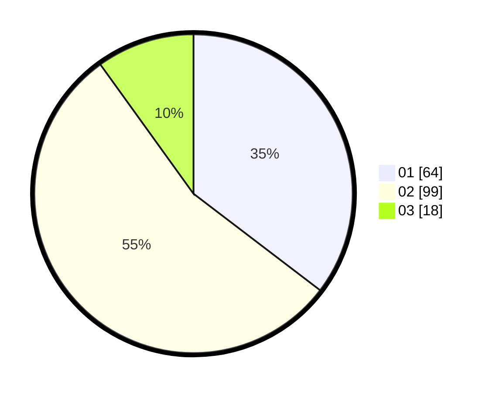

# Hasil

Hasil perolehan suara paslon dapat dilihat pada file paslon-01.txt, paslon-02.txt, dan paslon-03.txt.

Jika tidak ada, artinya data tersebut belum ada pada SIREKAP.

## Perolehan Suara

 * Paslon 01: **64**.
 * Paslon 02: **99**.
 * Paslon 03: **18**.

## Foto C Plano

https://sirekap-obj-formc.kpu.go.id/2869/pemilu/ppwp/31/75/09/10/01/3175091001215-20240214-203858--a6309e27-5d9e-4554-bdc2-ccbd7dbe78fa.jpg

https://sirekap-obj-formc.kpu.go.id/2869/pemilu/ppwp/31/75/09/10/01/3175091001215-20240214-210825--062d5a7c-d802-48c8-bf1a-a1f855199b13.jpg

https://sirekap-obj-formc.kpu.go.id/2869/pemilu/ppwp/31/75/09/10/01/3175091001215-20240214-210832--4fc4ac97-033d-4560-8978-7a47a3a1c0d6.jpg

## DATA PEMILIH TETAP

Jumlah pemilih dalam DPT: **232**.
 * L: **111**.
 * P: **121**.

## DATA PENGGUNA HAK PILIH

Jumlah pengguna hak pilih dalam DPT: **179**.
 * L: **81**.
 * P: **98**.

Jumlah pengguna hak pilih dalam DPTb: **0**.
 * L: **0**.
 * P: **0**.

Jumlah pengguna hak pilih dalam DPK: **3**.
 * L: **2**.
 * P: **1**.

Jumlah pengguna hak pilih: **182**.
 * L: **83**.
 * P: **99**.

## JUMLAH SUARA SAH DAN TIDAK SAH

JUMLAH SELURUH SUARA SAH: **181**.

JUMLAH SUARA TIDAK SAH: **1**.

JUMLAH SELURUH SUARA SAH DAN SUARA TIDAK SAH: **182**.
