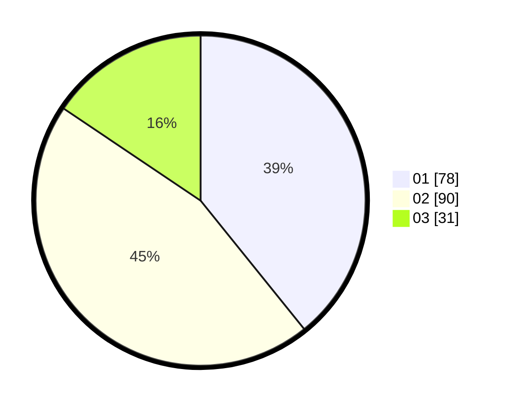

# Hasil

Hasil perolehan suara paslon dapat dilihat pada file paslon-01.txt, paslon-02.txt, dan paslon-03.txt.

Jika tidak ada, artinya data tersebut belum ada pada SIREKAP.

## Perolehan Suara

 * Paslon 01: **78**.
 * Paslon 02: **90**.
 * Paslon 03: **31**.

## Foto C Plano

https://sirekap-obj-formc.kpu.go.id/5c63/pemilu/ppwp/31/75/09/10/01/3175091001216-20240217-191847--afbf7839-76ad-4b49-8fe4-62a26d1e5c09.jpg

https://sirekap-obj-formc.kpu.go.id/5c63/pemilu/ppwp/31/75/09/10/01/3175091001216-20240217-194008--0b0dfb90-6739-4446-abc2-37208524b70d.jpg

https://sirekap-obj-formc.kpu.go.id/5c63/pemilu/ppwp/31/75/09/10/01/3175091001216-20240217-231758--40493db5-f471-47e7-8081-04b30ba5dea7.jpg

## DATA PEMILIH TETAP

Jumlah pemilih dalam DPT: **230**.
 * L: **117**.
 * P: **113**.

## DATA PENGGUNA HAK PILIH

Jumlah pengguna hak pilih dalam DPT: **198**.
 * L: **96**.
 * P: **102**.

Jumlah pengguna hak pilih dalam DPTb: **0**.
 * L: **0**.
 * P: **0**.

Jumlah pengguna hak pilih dalam DPK: **1**.
 * L: **1**.
 * P: **0**.

Jumlah pengguna hak pilih: **199**.
 * L: **97**.
 * P: **102**.

## JUMLAH SUARA SAH DAN TIDAK SAH

JUMLAH SELURUH SUARA SAH: **199**.

JUMLAH SUARA TIDAK SAH: **0**.

JUMLAH SELURUH SUARA SAH DAN SUARA TIDAK SAH: **199**.
