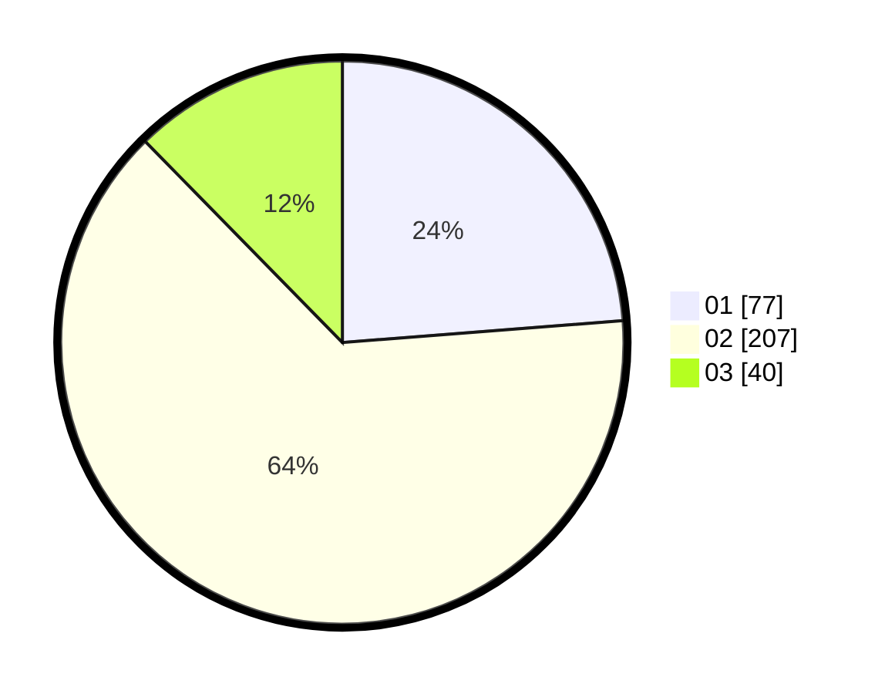

# Hasil

Hasil perolehan suara paslon dapat dilihat pada file paslon-01.txt, paslon-02.txt, dan paslon-03.txt.

Jika tidak ada, artinya data tersebut belum ada pada SIREKAP.

## Perolehan Suara

 * Paslon 01: **77**.
 * Paslon 02: **207**.
 * Paslon 03: **40**.

## Foto C Plano

https://sirekap-obj-formc.kpu.go.id/b465/pemilu/ppwp/31/75/09/10/02/3175091002002-20240216-171458--07713ead-ac7d-4ea0-9270-8f107c7ca42d.jpg

https://sirekap-obj-formc.kpu.go.id/b465/pemilu/ppwp/31/75/09/10/02/3175091002002-20240216-171632--3aaf886d-bada-4f6b-87ae-9078128279a9.jpg

https://sirekap-obj-formc.kpu.go.id/b465/pemilu/ppwp/31/75/09/10/02/3175091002002-20240216-171844--08a7304d-3125-4490-86de-0a68a9c155ab.jpg

## DATA PEMILIH TETAP

Jumlah pemilih dalam DPT: **275**.
 * L: **134**.
 * P: **141**.

## DATA PENGGUNA HAK PILIH

Jumlah pengguna hak pilih dalam DPT: **223**.
 * L: **105**.
 * P: **118**.

Jumlah pengguna hak pilih dalam DPTb: **872**.
 * L: **775**.
 * P: **727**.

Jumlah pengguna hak pilih dalam DPK: **1**.
 * L: **0**.
 * P: **1**.

Jumlah pengguna hak pilih: **224**.
 * L: **105**.
 * P: **119**.

## JUMLAH SUARA SAH DAN TIDAK SAH

JUMLAH SELURUH SUARA SAH: **20**.

JUMLAH SUARA TIDAK SAH: **4**.

JUMLAH SELURUH SUARA SAH DAN SUARA TIDAK SAH: **224**.
