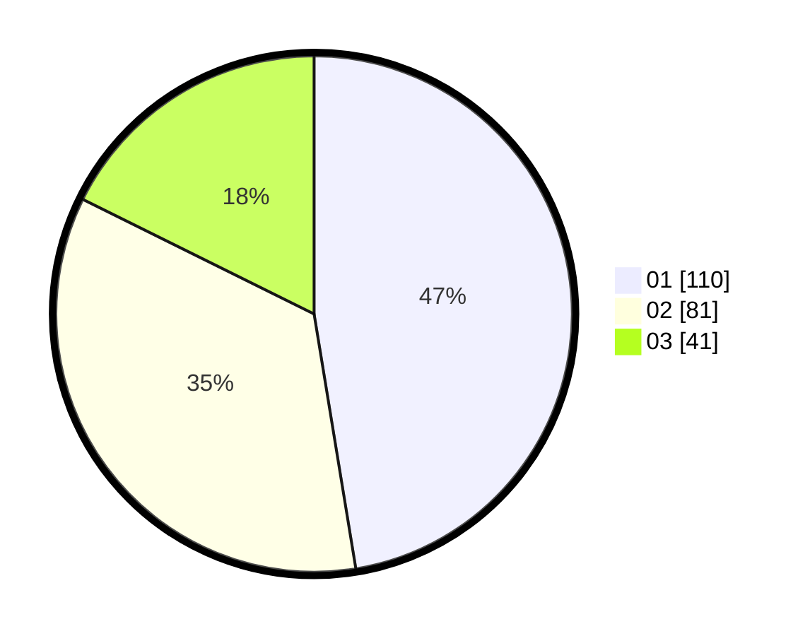

# Hasil

Hasil perolehan suara paslon dapat dilihat pada file paslon-01.txt, paslon-02.txt, dan paslon-03.txt.

Jika tidak ada, artinya data tersebut belum ada pada SIREKAP.

## Perolehan Suara

 * Paslon 01: **110**.
 * Paslon 02: **81**.
 * Paslon 03: **41**.

## Foto C Plano

https://sirekap-obj-formc.kpu.go.id/cd81/pemilu/ppwp/31/75/09/10/02/3175091002004-20240214-162231--389a5f8c-4015-41c9-8fc6-3f31a7dd244f.jpg

https://sirekap-obj-formc.kpu.go.id/cd81/pemilu/ppwp/31/75/09/10/02/3175091002004-20240214-201129--7b48083d-1fba-4094-921c-39a8a15432bc.jpg

https://sirekap-obj-formc.kpu.go.id/cd81/pemilu/ppwp/31/75/09/10/02/3175091002004-20240215-211641--6a358bd9-dc67-4e52-acd1-3425e98d35a5.jpg

## DATA PEMILIH TETAP

Jumlah pemilih dalam DPT: **269**.
 * L: **118**.
 * P: **151**.

## DATA PENGGUNA HAK PILIH

Jumlah pengguna hak pilih dalam DPT: **229**.
 * L: **98**.
 * P: **131**.

Jumlah pengguna hak pilih dalam DPTb: **1**.
 * L: **0**.
 * P: **1**.

Jumlah pengguna hak pilih dalam DPK: **3**.
 * L: **1**.
 * P: **2**.

Jumlah pengguna hak pilih: **233**.
 * L: **99**.
 * P: **134**.

## JUMLAH SUARA SAH DAN TIDAK SAH

JUMLAH SELURUH SUARA SAH: **232**.

JUMLAH SUARA TIDAK SAH: **1**.

JUMLAH SELURUH SUARA SAH DAN SUARA TIDAK SAH: **233**.
