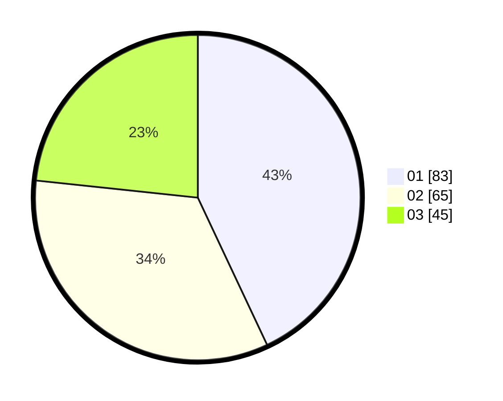

# Hasil

Hasil perolehan suara paslon dapat dilihat pada file paslon-01.txt, paslon-02.txt, dan paslon-03.txt.

Jika tidak ada, artinya data tersebut belum ada pada SIREKAP.

## Perolehan Suara

 * Paslon 01: **83**.
 * Paslon 02: **65**.
 * Paslon 03: **45**.

## Foto C Plano

https://sirekap-obj-formc.kpu.go.id/9757/pemilu/ppwp/31/75/09/10/02/3175091002005-20240216-193930--6e33e39f-e24a-4955-8007-41edd63ae67e.jpg

https://sirekap-obj-formc.kpu.go.id/9757/pemilu/ppwp/31/75/09/10/02/3175091002005-20240216-194001--f7c8597d-f1a7-40a3-b6ea-0f250b7aef31.jpg

https://sirekap-obj-formc.kpu.go.id/9757/pemilu/ppwp/31/75/09/10/02/3175091002005-20240216-194028--0f7fb384-a892-4c05-a2c9-225603db3003.jpg

## DATA PEMILIH TETAP

Jumlah pemilih dalam DPT: **265**.
 * L: **132**.
 * P: **133**.

## DATA PENGGUNA HAK PILIH

Jumlah pengguna hak pilih dalam DPT: **555**.
 * L: **859**.
 * P: **555**.

Jumlah pengguna hak pilih dalam DPTb: **0**.
 * L: **0**.
 * P: **0**.

Jumlah pengguna hak pilih dalam DPK: **5**.
 * L: **3**.
 * P: **2**.

Jumlah pengguna hak pilih: **194**.
 * L: **92**.
 * P: **102**.

## JUMLAH SUARA SAH DAN TIDAK SAH

JUMLAH SELURUH SUARA SAH: **193**.

JUMLAH SUARA TIDAK SAH: **1**.

JUMLAH SELURUH SUARA SAH DAN SUARA TIDAK SAH: **194**.
