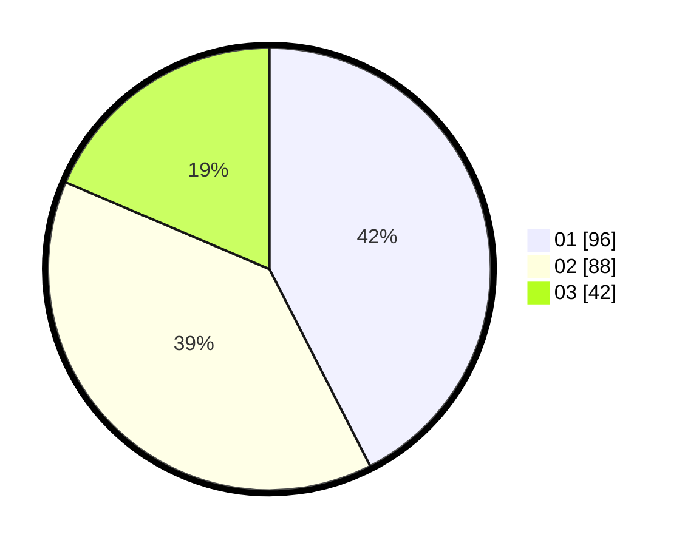

# Hasil

Hasil perolehan suara paslon dapat dilihat pada file paslon-01.txt, paslon-02.txt, dan paslon-03.txt.

Jika tidak ada, artinya data tersebut belum ada pada SIREKAP.

## Perolehan Suara

 * Paslon 01: **96**.
 * Paslon 02: **88**.
 * Paslon 03: **42**.

## Foto C Plano

https://sirekap-obj-formc.kpu.go.id/c0c8/pemilu/ppwp/31/75/09/10/02/3175091002008-20240216-135959--f9b5ed39-c9a1-4a67-97d1-9b1b977ee2aa.jpg

https://sirekap-obj-formc.kpu.go.id/c0c8/pemilu/ppwp/31/75/09/10/02/3175091002008-20240216-140543--88c7ef8e-9c84-4096-8dee-4be1991ad29e.jpg

https://sirekap-obj-formc.kpu.go.id/c0c8/pemilu/ppwp/31/75/09/10/02/3175091002008-20240216-140821--20ba1565-0a21-4ea1-80a3-4c8602e49667.jpg

## DATA PEMILIH TETAP

Jumlah pemilih dalam DPT: **275**.
 * L: **141**.
 * P: **134**.

## DATA PENGGUNA HAK PILIH

Jumlah pengguna hak pilih dalam DPT: **229**.
 * L: **115**.
 * P: **114**.

Jumlah pengguna hak pilih dalam DPTb: **0**.
 * L: **0**.
 * P: **0**.

Jumlah pengguna hak pilih dalam DPK: **0**.
 * L: **0**.
 * P: **0**.

Jumlah pengguna hak pilih: **229**.
 * L: **115**.
 * P: **114**.

## JUMLAH SUARA SAH DAN TIDAK SAH

JUMLAH SELURUH SUARA SAH: **226**.

JUMLAH SUARA TIDAK SAH: **3**.

JUMLAH SELURUH SUARA SAH DAN SUARA TIDAK SAH: **229**.
