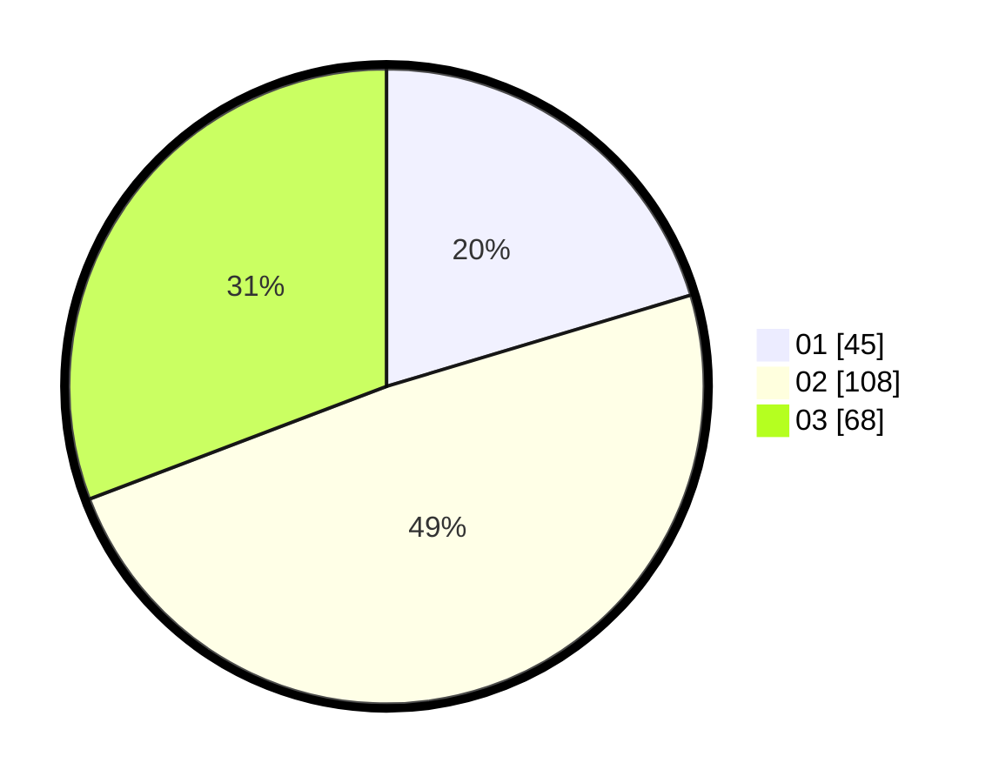

# Hasil

Hasil perolehan suara paslon dapat dilihat pada file paslon-01.txt, paslon-02.txt, dan paslon-03.txt.

Jika tidak ada, artinya data tersebut belum ada pada SIREKAP.

## Perolehan Suara

 * Paslon 01: **45**.
 * Paslon 02: **108**.
 * Paslon 03: **68**.

## Foto C Plano

https://sirekap-obj-formc.kpu.go.id/24f5/pemilu/ppwp/31/75/09/10/02/3175091002009-20240215-001715--619b42a8-6953-4a7c-a084-4b5beaba27bc.jpg

https://sirekap-obj-formc.kpu.go.id/24f5/pemilu/ppwp/31/75/09/10/02/3175091002009-20240215-001744--21da0e54-c6e9-4c31-8f50-fb22b7bbf90c.jpg

https://sirekap-obj-formc.kpu.go.id/24f5/pemilu/ppwp/31/75/09/10/02/3175091002009-20240215-001824--c85c3e83-17f3-4f58-8e45-aac3baaf67ec.jpg

## DATA PEMILIH TETAP

Jumlah pemilih dalam DPT: **275**.
 * L: **131**.
 * P: **144**.

## DATA PENGGUNA HAK PILIH

Jumlah pengguna hak pilih dalam DPT: **223**.
 * L: **107**.
 * P: **116**.

Jumlah pengguna hak pilih dalam DPTb: **0**.
 * L: **0**.
 * P: **0**.

Jumlah pengguna hak pilih dalam DPK: **0**.
 * L: **0**.
 * P: **0**.

Jumlah pengguna hak pilih: **223**.
 * L: **107**.
 * P: **116**.

## JUMLAH SUARA SAH DAN TIDAK SAH

JUMLAH SELURUH SUARA SAH: **221**.

JUMLAH SUARA TIDAK SAH: **2**.

JUMLAH SELURUH SUARA SAH DAN SUARA TIDAK SAH: **223**.
