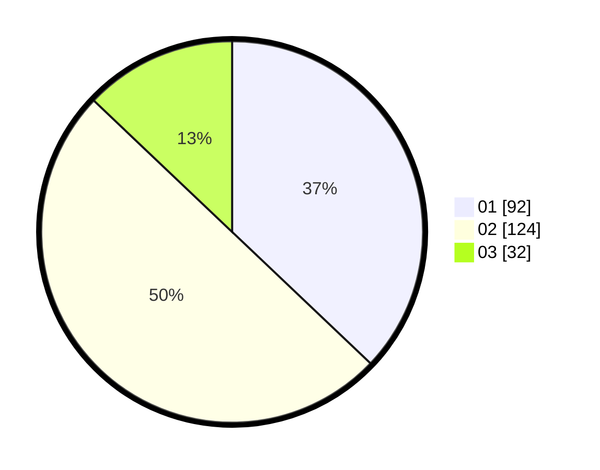

# Hasil

Hasil perolehan suara paslon dapat dilihat pada file paslon-01.txt, paslon-02.txt, dan paslon-03.txt.

Jika tidak ada, artinya data tersebut belum ada pada SIREKAP.

## Perolehan Suara

 * Paslon 01: **92**.
 * Paslon 02: **124**.
 * Paslon 03: **32**.

## Foto C Plano

https://sirekap-obj-formc.kpu.go.id/0e6d/pemilu/ppwp/31/75/09/10/02/3175091002011-20240214-185853--318d28b8-3dc7-4297-9fa9-c9d1d6de86bd.jpg

https://sirekap-obj-formc.kpu.go.id/0e6d/pemilu/ppwp/31/75/09/10/02/3175091002011-20240214-190022--1d321b76-ef09-4bd8-8436-076ee4cfd7e8.jpg

https://sirekap-obj-formc.kpu.go.id/0e6d/pemilu/ppwp/31/75/09/10/02/3175091002011-20240214-190447--9b4d61ac-97b6-4ac4-9a62-6883954f7398.jpg

## DATA PEMILIH TETAP

Jumlah pemilih dalam DPT: **287**.
 * L: **131**.
 * P: **156**.

## DATA PENGGUNA HAK PILIH

Jumlah pengguna hak pilih dalam DPT: **249**.
 * L: **109**.
 * P: **140**.

Jumlah pengguna hak pilih dalam DPTb: **1**.
 * L: **0**.
 * P: **1**.

Jumlah pengguna hak pilih dalam DPK: **0**.
 * L: **0**.
 * P: **0**.

Jumlah pengguna hak pilih: **250**.
 * L: **109**.
 * P: **141**.

## JUMLAH SUARA SAH DAN TIDAK SAH

JUMLAH SELURUH SUARA SAH: **248**.

JUMLAH SUARA TIDAK SAH: **2**.

JUMLAH SELURUH SUARA SAH DAN SUARA TIDAK SAH: **250**.
