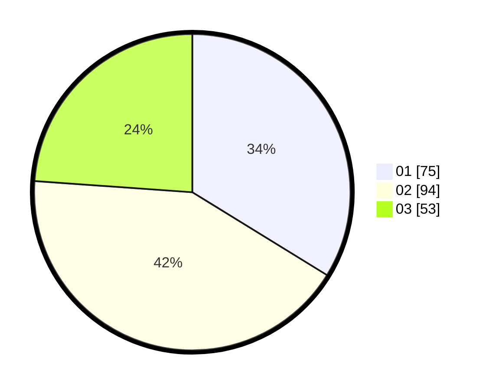

# Hasil

Hasil perolehan suara paslon dapat dilihat pada file paslon-01.txt, paslon-02.txt, dan paslon-03.txt.

Jika tidak ada, artinya data tersebut belum ada pada SIREKAP.

## Perolehan Suara

 * Paslon 01: **75**.
 * Paslon 02: **94**.
 * Paslon 03: **53**.

## Foto C Plano

https://sirekap-obj-formc.kpu.go.id/a27b/pemilu/ppwp/31/75/09/10/02/3175091002014-20240215-214836--93fe101a-b225-4279-903b-473cd333f474.jpg

https://sirekap-obj-formc.kpu.go.id/a27b/pemilu/ppwp/31/75/09/10/02/3175091002014-20240215-214601--b8d01b9d-03f9-4170-96c3-1d05f60b5658.jpg

https://sirekap-obj-formc.kpu.go.id/a27b/pemilu/ppwp/31/75/09/10/02/3175091002014-20240215-215158--1b89d373-e964-4d3c-bb25-083db1d972f2.jpg
