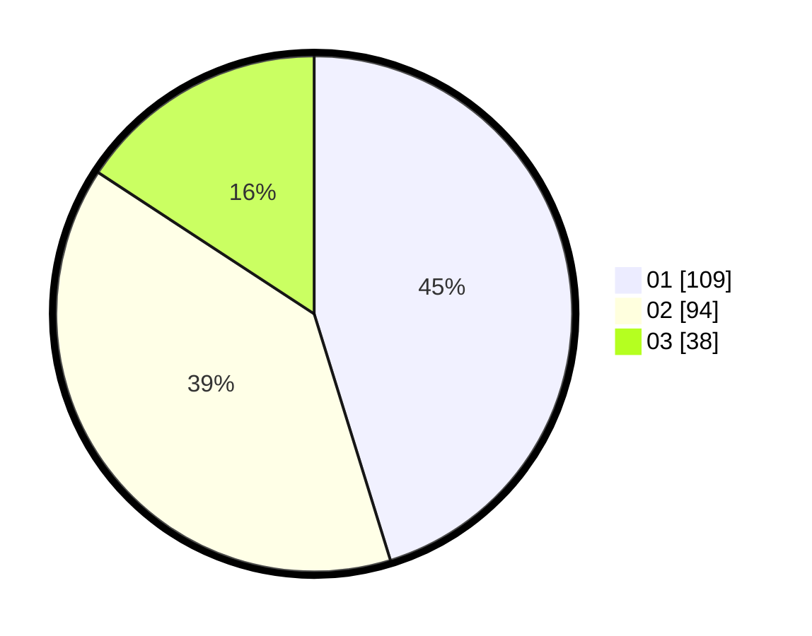

# Hasil

Hasil perolehan suara paslon dapat dilihat pada file paslon-01.txt, paslon-02.txt, dan paslon-03.txt.

Jika tidak ada, artinya data tersebut belum ada pada SIREKAP.

## Perolehan Suara

 * Paslon 01: **109**.
 * Paslon 02: **94**.
 * Paslon 03: **38**.

## Foto C Plano

https://sirekap-obj-formc.kpu.go.id/7bd6/pemilu/ppwp/31/75/09/10/02/3175091002019-20240214-192745--31817126-e595-4036-ac3b-3f34348eebe8.jpg

https://sirekap-obj-formc.kpu.go.id/7bd6/pemilu/ppwp/31/75/09/10/02/3175091002019-20240214-192943--f5f321e1-ba95-4393-bd3a-15023b18f389.jpg

https://sirekap-obj-formc.kpu.go.id/7bd6/pemilu/ppwp/31/75/09/10/02/3175091002019-20240214-210450--8a61523e-ad2f-4251-b290-f5cf04d6344c.jpg
