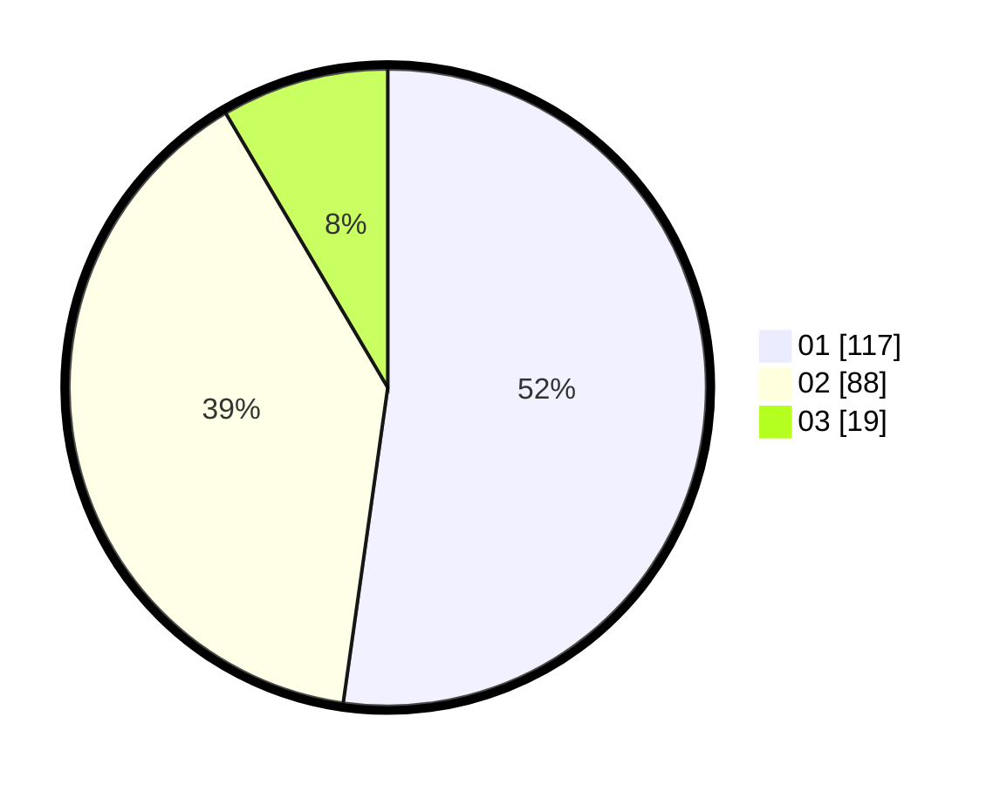

# Hasil

Hasil perolehan suara paslon dapat dilihat pada file paslon-01.txt, paslon-02.txt, dan paslon-03.txt.

Jika tidak ada, artinya data tersebut belum ada pada SIREKAP.

## Perolehan Suara

 * Paslon 01: **117**.
 * Paslon 02: **88**.
 * Paslon 03: **19**.

## Foto C Plano

https://sirekap-obj-formc.kpu.go.id/3db4/pemilu/ppwp/31/75/09/10/02/3175091002024-20240214-220050--f9cbef3a-8d5e-4eff-bde8-af68f349d97b.jpg

https://sirekap-obj-formc.kpu.go.id/3db4/pemilu/ppwp/31/75/09/10/02/3175091002024-20240214-213149--39eb971d-d9d8-482f-89a8-b03d45c0e1fe.jpg

https://sirekap-obj-formc.kpu.go.id/3db4/pemilu/ppwp/31/75/09/10/02/3175091002024-20240214-203127--ac44977b-ca1b-4373-88ea-de4f12a63128.jpg

## DATA PEMILIH TETAP

Jumlah pemilih dalam DPT: **279**.
 * L: **136**.
 * P: **143**.

## DATA PENGGUNA HAK PILIH

Jumlah pengguna hak pilih dalam DPT: **228**.
 * L: **109**.
 * P: **119**.

Jumlah pengguna hak pilih dalam DPTb: **1**.
 * L: **1**.
 * P: **0**.

Jumlah pengguna hak pilih dalam DPK: **0**.
 * L: **0**.
 * P: **0**.

Jumlah pengguna hak pilih: **229**.
 * L: **110**.
 * P: **119**.

## JUMLAH SUARA SAH DAN TIDAK SAH

JUMLAH SELURUH SUARA SAH: **224**.

JUMLAH SUARA TIDAK SAH: **5**.

JUMLAH SELURUH SUARA SAH DAN SUARA TIDAK SAH: **229**.
