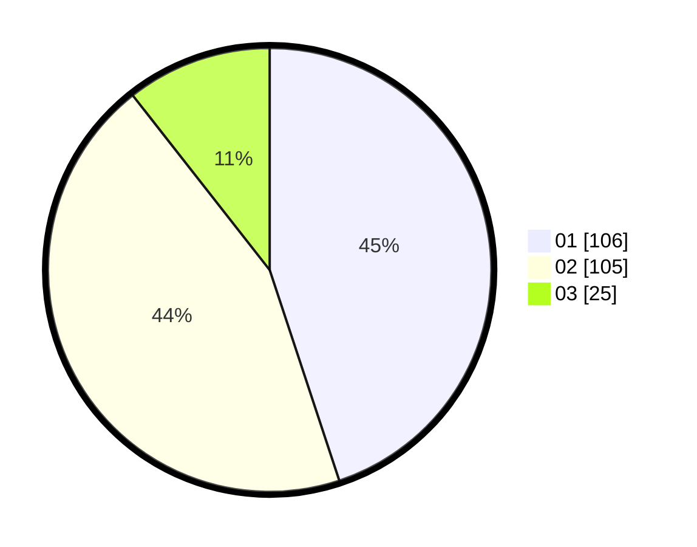

# Hasil

Hasil perolehan suara paslon dapat dilihat pada file paslon-01.txt, paslon-02.txt, dan paslon-03.txt.

Jika tidak ada, artinya data tersebut belum ada pada SIREKAP.

## Perolehan Suara

 * Paslon 01: **106**.
 * Paslon 02: **105**.
 * Paslon 03: **25**.

## Foto C Plano

https://sirekap-obj-formc.kpu.go.id/5a66/pemilu/ppwp/31/75/09/10/02/3175091002025-20240214-202058--31b7713e-0fb9-4cc9-bfd6-2225ed3ff1fd.jpg

https://sirekap-obj-formc.kpu.go.id/5a66/pemilu/ppwp/31/75/09/10/02/3175091002025-20240216-141448--0ebd5ce3-63ff-4daf-b735-8ae2ed4a91ee.jpg

https://sirekap-obj-formc.kpu.go.id/5a66/pemilu/ppwp/31/75/09/10/02/3175091002025-20240214-202317--bd103aed-4937-42b2-bf9b-d2bacb263bef.jpg

## DATA PEMILIH TETAP

Jumlah pemilih dalam DPT: **276**.
 * L: **130**.
 * P: **146**.

## DATA PENGGUNA HAK PILIH

Jumlah pengguna hak pilih dalam DPT: **237**.
 * L: **110**.
 * P: **127**.

Jumlah pengguna hak pilih dalam DPTb: **1**.
 * L: **0**.
 * P: **1**.

Jumlah pengguna hak pilih dalam DPK: **1**.
 * L: **1**.
 * P: **0**.

Jumlah pengguna hak pilih: **239**.
 * L: **111**.
 * P: **128**.

## JUMLAH SUARA SAH DAN TIDAK SAH

JUMLAH SELURUH SUARA SAH: **236**.

JUMLAH SUARA TIDAK SAH: **3**.

JUMLAH SELURUH SUARA SAH DAN SUARA TIDAK SAH: **239**.
