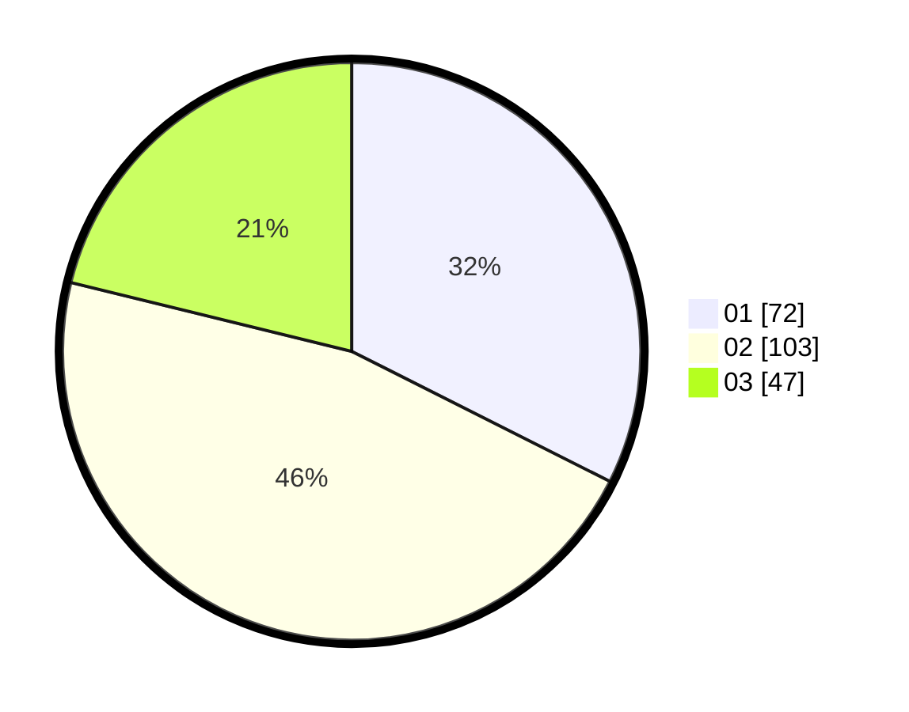

# Hasil

Hasil perolehan suara paslon dapat dilihat pada file paslon-01.txt, paslon-02.txt, dan paslon-03.txt.

Jika tidak ada, artinya data tersebut belum ada pada SIREKAP.

## Perolehan Suara

 * Paslon 01: **72**.
 * Paslon 02: **103**.
 * Paslon 03: **47**.

## Foto C Plano

https://sirekap-obj-formc.kpu.go.id/8822/pemilu/ppwp/31/75/09/10/02/3175091002028-20240215-092109--0c4eb440-c438-48ef-bd85-1de1d43538cb.jpg

https://sirekap-obj-formc.kpu.go.id/8822/pemilu/ppwp/31/75/09/10/02/3175091002028-20240215-122420--16fda52e-f738-4de8-bd62-6a680153d693.jpg

https://sirekap-obj-formc.kpu.go.id/8822/pemilu/ppwp/31/75/09/10/02/3175091002028-20240215-190119--b059ab84-1527-4103-ba81-43fc707dc0c7.jpg

## DATA PEMILIH TETAP

Jumlah pemilih dalam DPT: **292**.
 * L: **132**.
 * P: **160**.

## DATA PENGGUNA HAK PILIH

Jumlah pengguna hak pilih dalam DPT: **220**.
 * L: **100**.
 * P: **120**.

Jumlah pengguna hak pilih dalam DPTb: **3**.
 * L: **2**.
 * P: **1**.

Jumlah pengguna hak pilih dalam DPK: **2**.
 * L: **1**.
 * P: **1**.

Jumlah pengguna hak pilih: **225**.
 * L: **103**.
 * P: **122**.

## JUMLAH SUARA SAH DAN TIDAK SAH

JUMLAH SELURUH SUARA SAH: **222**.

JUMLAH SUARA TIDAK SAH: **3**.

JUMLAH SELURUH SUARA SAH DAN SUARA TIDAK SAH: **225**.
