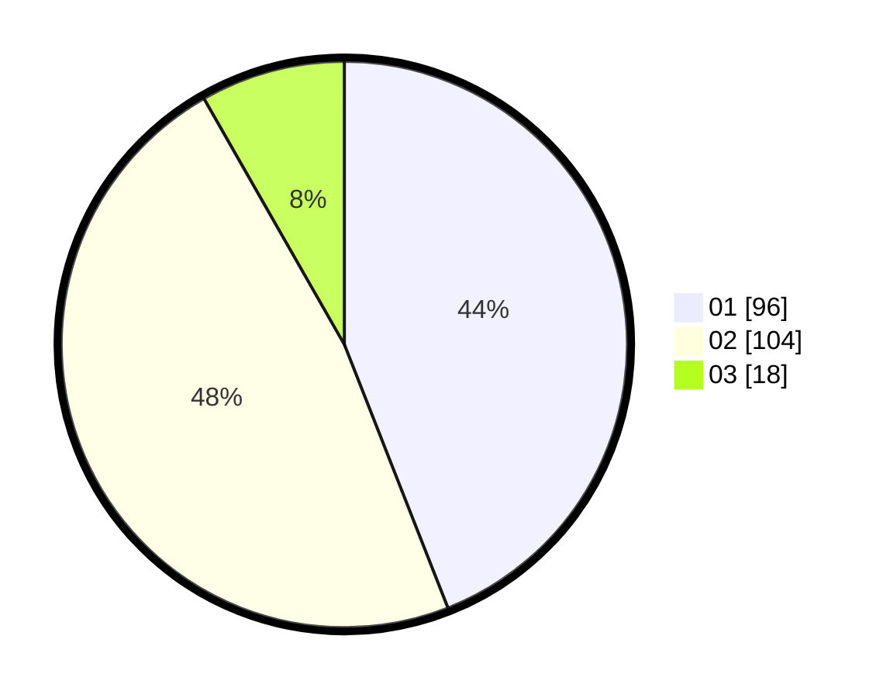

# Hasil

Hasil perolehan suara paslon dapat dilihat pada file paslon-01.txt, paslon-02.txt, dan paslon-03.txt.

Jika tidak ada, artinya data tersebut belum ada pada SIREKAP.

## Perolehan Suara

 * Paslon 01: **96**.
 * Paslon 02: **104**.
 * Paslon 03: **18**.

## Foto C Plano

https://sirekap-obj-formc.kpu.go.id/9d18/pemilu/ppwp/31/75/09/10/02/3175091002039-20240216-184816--5cb6ad38-d33e-42f9-89e9-1335534e0e18.jpg

https://sirekap-obj-formc.kpu.go.id/9d18/pemilu/ppwp/31/75/09/10/02/3175091002039-20240216-185416--8892ebb3-8e6f-4971-8b51-bd8bc4a665c9.jpg

https://sirekap-obj-formc.kpu.go.id/9d18/pemilu/ppwp/31/75/09/10/02/3175091002039-20240216-185917--70cda284-6c36-4f07-b717-d07601270569.jpg

## DATA PEMILIH TETAP

Jumlah pemilih dalam DPT: **269**.
 * L: **124**.
 * P: **145**.

## DATA PENGGUNA HAK PILIH

Jumlah pengguna hak pilih dalam DPT: **223**.
 * L: **97**.
 * P: **126**.

Jumlah pengguna hak pilih dalam DPTb: **0**.
 * L: **0**.
 * P: **0**.

Jumlah pengguna hak pilih dalam DPK: **0**.
 * L: **0**.
 * P: **0**.

Jumlah pengguna hak pilih: **223**.
 * L: **97**.
 * P: **126**.

## JUMLAH SUARA SAH DAN TIDAK SAH

JUMLAH SELURUH SUARA SAH: **218**.

JUMLAH SUARA TIDAK SAH: **5**.

JUMLAH SELURUH SUARA SAH DAN SUARA TIDAK SAH: **223**.
