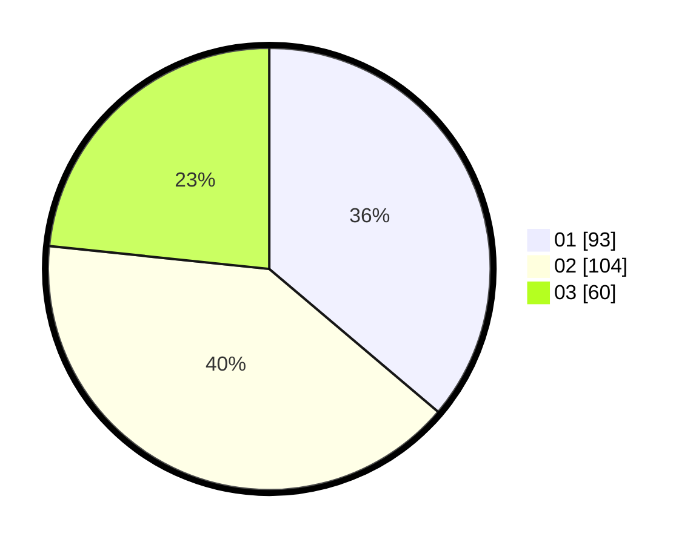

# Hasil

Hasil perolehan suara paslon dapat dilihat pada file paslon-01.txt, paslon-02.txt, dan paslon-03.txt.

Jika tidak ada, artinya data tersebut belum ada pada SIREKAP.

## Perolehan Suara

 * Paslon 01: **93**.
 * Paslon 02: **104**.
 * Paslon 03: **60**.

## Foto C Plano

https://sirekap-obj-formc.kpu.go.id/fd45/pemilu/ppwp/31/75/09/10/02/3175091002040-20240214-194318--a99172a7-c918-4de9-a928-32a1ea9bd9ba.jpg

https://sirekap-obj-formc.kpu.go.id/fd45/pemilu/ppwp/31/75/09/10/02/3175091002040-20240214-194327--b26a3f4e-64c7-4e37-8c54-9b4b0fb6d771.jpg
