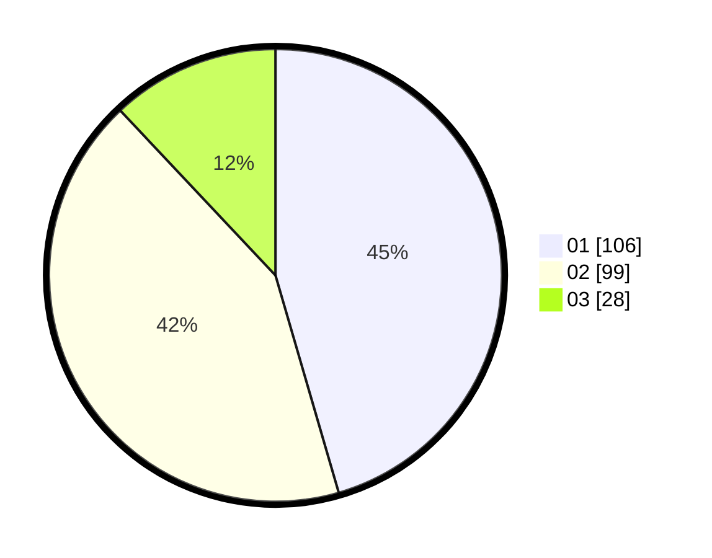

# Hasil

Hasil perolehan suara paslon dapat dilihat pada file paslon-01.txt, paslon-02.txt, dan paslon-03.txt.

Jika tidak ada, artinya data tersebut belum ada pada SIREKAP.

## Perolehan Suara

 * Paslon 01: **106**.
 * Paslon 02: **99**.
 * Paslon 03: **28**.

## Foto C Plano

https://sirekap-obj-formc.kpu.go.id/87c1/pemilu/ppwp/31/75/09/10/02/3175091002042-20240214-211703--d2e88a0f-d9e4-4f85-8986-7c937710f2c4.jpg

https://sirekap-obj-formc.kpu.go.id/87c1/pemilu/ppwp/31/75/09/10/02/3175091002042-20240214-211744--2e503364-01cf-4b2d-9e3a-12edf926fde1.jpg

https://sirekap-obj-formc.kpu.go.id/87c1/pemilu/ppwp/31/75/09/10/02/3175091002042-20240214-211818--c15b4f71-101c-4704-b9bf-b69eddc22ef9.jpg
