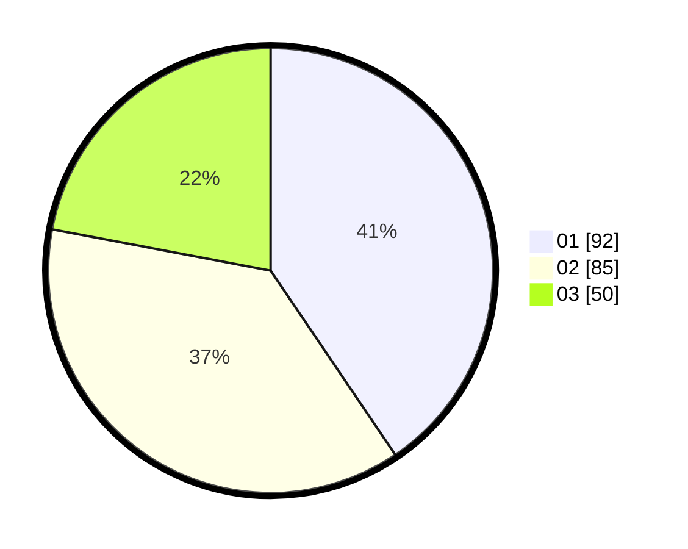

# Hasil

Hasil perolehan suara paslon dapat dilihat pada file paslon-01.txt, paslon-02.txt, dan paslon-03.txt.

Jika tidak ada, artinya data tersebut belum ada pada SIREKAP.

## Perolehan Suara

 * Paslon 01: **92**.
 * Paslon 02: **85**.
 * Paslon 03: **50**.

## Foto C Plano

https://sirekap-obj-formc.kpu.go.id/4bae/pemilu/ppwp/31/75/09/10/02/3175091002048-20240214-155123--fc7de2b7-1897-4faa-a1e8-a4256c2a1fab.jpg

https://sirekap-obj-formc.kpu.go.id/4bae/pemilu/ppwp/31/75/09/10/02/3175091002048-20240214-155213--f0ecb3ef-59c0-454d-b9f9-7e5a8ee12c0b.jpg

https://sirekap-obj-formc.kpu.go.id/4bae/pemilu/ppwp/31/75/09/10/02/3175091002048-20240214-155250--e84ea276-5329-4b50-9222-7ffcfdd96ab6.jpg

## DATA PEMILIH TETAP

Jumlah pemilih dalam DPT: **229**.
 * L: **113**.
 * P: **116**.

## DATA PENGGUNA HAK PILIH

Jumlah pengguna hak pilih dalam DPT: **224**.
 * L: **111**.
 * P: **113**.

Jumlah pengguna hak pilih dalam DPTb: **2**.
 * L: **1**.
 * P: **1**.

Jumlah pengguna hak pilih dalam DPK: **3**.
 * L: **1**.
 * P: **2**.

Jumlah pengguna hak pilih: **229**.
 * L: **113**.
 * P: **116**.

## JUMLAH SUARA SAH DAN TIDAK SAH

JUMLAH SELURUH SUARA SAH: **227**.

JUMLAH SUARA TIDAK SAH: **2**.

JUMLAH SELURUH SUARA SAH DAN SUARA TIDAK SAH: **229**.
