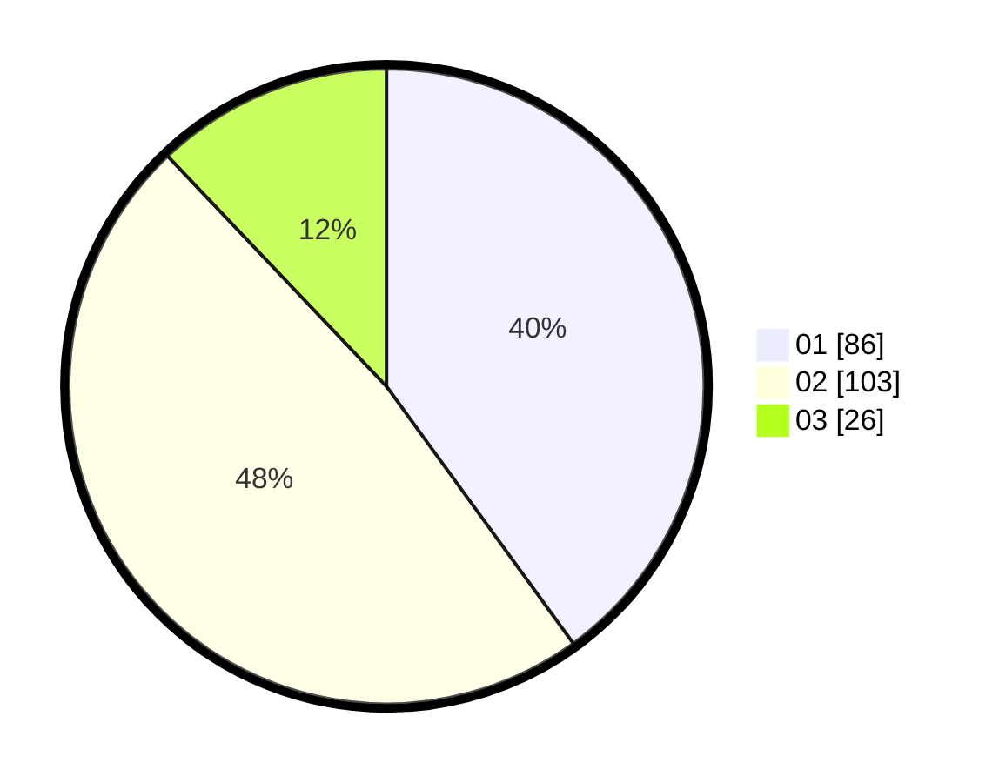

# Hasil

Hasil perolehan suara paslon dapat dilihat pada file paslon-01.txt, paslon-02.txt, dan paslon-03.txt.

Jika tidak ada, artinya data tersebut belum ada pada SIREKAP.

## Perolehan Suara

 * Paslon 01: **86**.
 * Paslon 02: **103**.
 * Paslon 03: **26**.

## Foto C Plano

https://sirekap-obj-formc.kpu.go.id/62a8/pemilu/ppwp/31/75/09/10/02/3175091002049-20240217-232200--e1bd2faf-2dd2-4843-8932-c92a52c1299e.jpg

https://sirekap-obj-formc.kpu.go.id/62a8/pemilu/ppwp/31/75/09/10/02/3175091002049-20240217-232201--fe7e08fa-3ba4-48ca-9f83-f4a8bcc84d0b.jpg

https://sirekap-obj-formc.kpu.go.id/62a8/pemilu/ppwp/31/75/09/10/02/3175091002049-20240217-232201--b85a847e-8286-472b-91a0-1da8dfb4b436.jpg

## DATA PEMILIH TETAP

Jumlah pemilih dalam DPT: **215**.
 * L: **94**.
 * P: **121**.

## DATA PENGGUNA HAK PILIH

Jumlah pengguna hak pilih dalam DPT: **215**.
 * L: **94**.
 * P: **121**.

Jumlah pengguna hak pilih dalam DPTb: **0**.
 * L: **0**.
 * P: **0**.

Jumlah pengguna hak pilih dalam DPK: **1**.
 * L: **0**.
 * P: **1**.

Jumlah pengguna hak pilih: **216**.
 * L: **94**.
 * P: **122**.

## JUMLAH SUARA SAH DAN TIDAK SAH

JUMLAH SELURUH SUARA SAH: **215**.

JUMLAH SUARA TIDAK SAH: **1**.

JUMLAH SELURUH SUARA SAH DAN SUARA TIDAK SAH: **216**.
