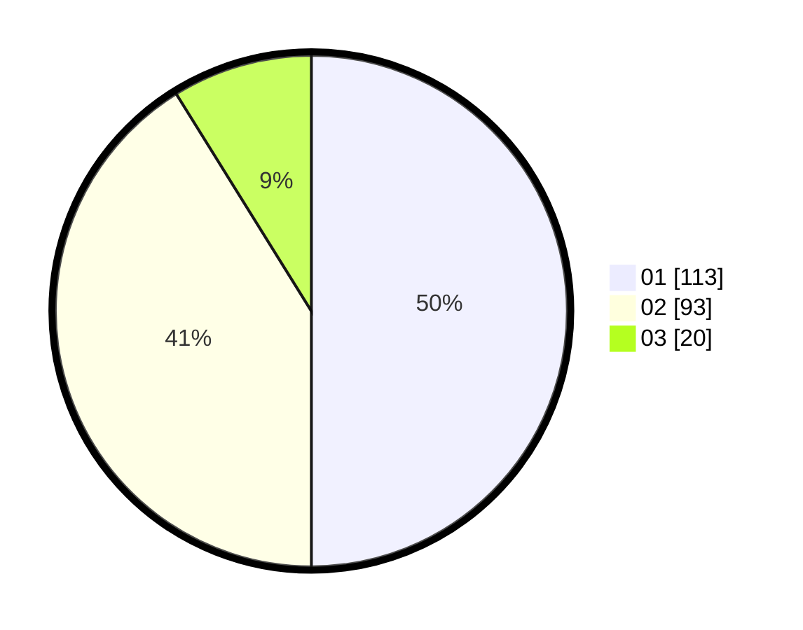

# Hasil

Hasil perolehan suara paslon dapat dilihat pada file paslon-01.txt, paslon-02.txt, dan paslon-03.txt.

Jika tidak ada, artinya data tersebut belum ada pada SIREKAP.

## Perolehan Suara

 * Paslon 01: **113**.
 * Paslon 02: **93**.
 * Paslon 03: **20**.

## Foto C Plano

https://sirekap-obj-formc.kpu.go.id/0d0e/pemilu/ppwp/31/75/09/10/02/3175091002052-20240215-030034--03196e1d-ecbb-4e82-b1cb-41a93a83548d.jpg

https://sirekap-obj-formc.kpu.go.id/0d0e/pemilu/ppwp/31/75/09/10/02/3175091002052-20240215-030207--918f9121-07b0-459d-b36b-f5039f4f2930.jpg

https://sirekap-obj-formc.kpu.go.id/0d0e/pemilu/ppwp/31/75/09/10/02/3175091002052-20240215-025832--a75612e0-7d63-4197-aef5-4c24bdbb6a93.jpg
