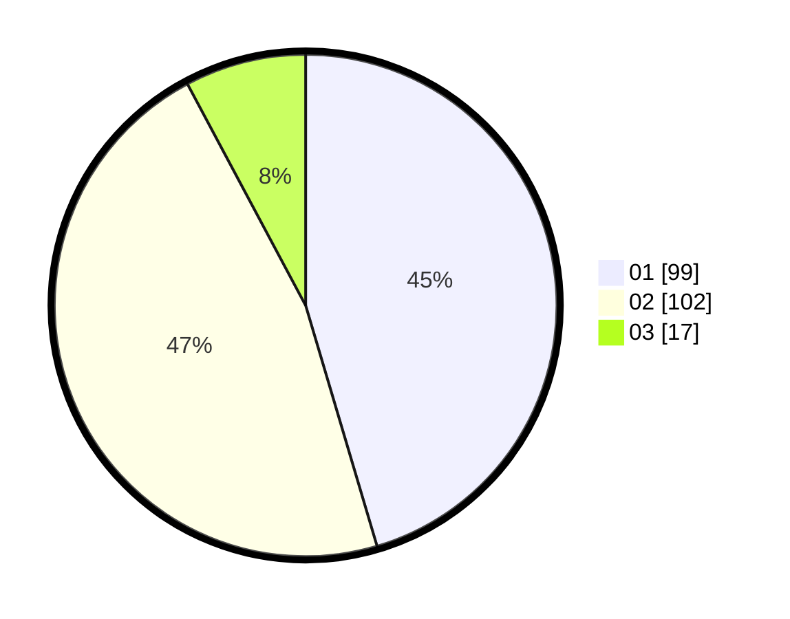

# Hasil

Hasil perolehan suara paslon dapat dilihat pada file paslon-01.txt, paslon-02.txt, dan paslon-03.txt.

Jika tidak ada, artinya data tersebut belum ada pada SIREKAP.

## Perolehan Suara

 * Paslon 01: **99**.
 * Paslon 02: **102**.
 * Paslon 03: **17**.

## Foto C Plano

https://sirekap-obj-formc.kpu.go.id/13f1/pemilu/ppwp/31/75/09/10/02/3175091002053-20240218-211424--45608e8f-5614-40ff-8a1f-bf91787c98b4.jpg

https://sirekap-obj-formc.kpu.go.id/13f1/pemilu/ppwp/31/75/09/10/02/3175091002053-20240218-211807--51d3cd31-901e-40fe-808e-7a234769691c.jpg

https://sirekap-obj-formc.kpu.go.id/13f1/pemilu/ppwp/31/75/09/10/02/3175091002053-20240218-211909--164d5cd4-9e16-4189-b09f-b1e22a24d0e3.jpg

## DATA PEMILIH TETAP

Jumlah pemilih dalam DPT: **264**.
 * L: **129**.
 * P: **135**.

## DATA PENGGUNA HAK PILIH

Jumlah pengguna hak pilih dalam DPT: **220**.
 * L: **107**.
 * P: **113**.

Jumlah pengguna hak pilih dalam DPTb: **1**.
 * L: **1**.
 * P: **0**.

Jumlah pengguna hak pilih dalam DPK: **2**.
 * L: **1**.
 * P: **1**.

Jumlah pengguna hak pilih: **223**.
 * L: **109**.
 * P: **114**.

## JUMLAH SUARA SAH DAN TIDAK SAH

JUMLAH SELURUH SUARA SAH: **218**.

JUMLAH SUARA TIDAK SAH: **5**.

JUMLAH SELURUH SUARA SAH DAN SUARA TIDAK SAH: **223**.
