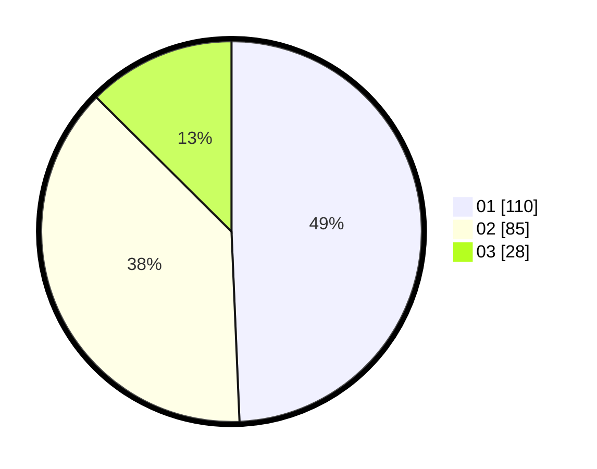

# Hasil

Hasil perolehan suara paslon dapat dilihat pada file paslon-01.txt, paslon-02.txt, dan paslon-03.txt.

Jika tidak ada, artinya data tersebut belum ada pada SIREKAP.

## Perolehan Suara

 * Paslon 01: **110**.
 * Paslon 02: **85**.
 * Paslon 03: **28**.

## Foto C Plano

https://sirekap-obj-formc.kpu.go.id/79b3/pemilu/ppwp/31/75/09/10/02/3175091002054-20240214-190013--298bff8d-bbee-44bb-b5f0-deb6253c1364.jpg

https://sirekap-obj-formc.kpu.go.id/79b3/pemilu/ppwp/31/75/09/10/02/3175091002054-20240214-190158--620bc09f-b508-4ef3-8e20-3ab8d65c8a6a.jpg

https://sirekap-obj-formc.kpu.go.id/79b3/pemilu/ppwp/31/75/09/10/02/3175091002054-20240214-190123--61db1238-650f-4090-a646-2436c60778e3.jpg

## DATA PEMILIH TETAP

Jumlah pemilih dalam DPT: **269**.
 * L: **124**.
 * P: **145**.

## DATA PENGGUNA HAK PILIH

Jumlah pengguna hak pilih dalam DPT: **228**.
 * L: **104**.
 * P: **124**.

Jumlah pengguna hak pilih dalam DPTb: **0**.
 * L: **0**.
 * P: **0**.

Jumlah pengguna hak pilih dalam DPK: **0**.
 * L: **0**.
 * P: **0**.

Jumlah pengguna hak pilih: **228**.
 * L: **104**.
 * P: **124**.

## JUMLAH SUARA SAH DAN TIDAK SAH

JUMLAH SELURUH SUARA SAH: **223**.

JUMLAH SUARA TIDAK SAH: **5**.

JUMLAH SELURUH SUARA SAH DAN SUARA TIDAK SAH: **228**.
