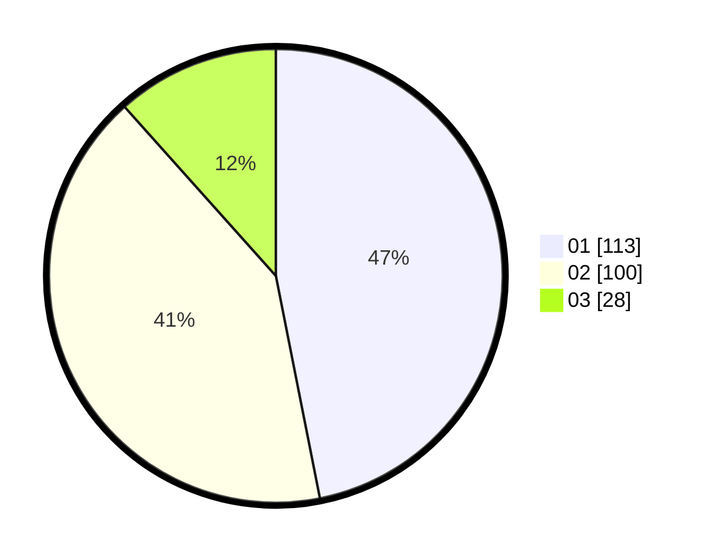

# Hasil

Hasil perolehan suara paslon dapat dilihat pada file paslon-01.txt, paslon-02.txt, dan paslon-03.txt.

Jika tidak ada, artinya data tersebut belum ada pada SIREKAP.

## Perolehan Suara

 * Paslon 01: **113**.
 * Paslon 02: **100**.
 * Paslon 03: **28**.

## Foto C Plano

https://sirekap-obj-formc.kpu.go.id/1383/pemilu/ppwp/31/75/09/10/02/3175091002057-20240217-100526--9667b5f3-c246-4c07-8b14-1fc9b7606638.jpg

https://sirekap-obj-formc.kpu.go.id/1383/pemilu/ppwp/31/75/09/10/02/3175091002057-20240217-100928--150186ec-bfc9-4a16-85b5-e7716196e60a.jpg

https://sirekap-obj-formc.kpu.go.id/1383/pemilu/ppwp/31/75/09/10/02/3175091002057-20240217-101157--092edda0-1f07-4b02-9156-5ef7555d214c.jpg

## DATA PEMILIH TETAP

Jumlah pemilih dalam DPT: **281**.
 * L: **138**.
 * P: **143**.

## DATA PENGGUNA HAK PILIH

Jumlah pengguna hak pilih dalam DPT: **247**.
 * L: **117**.
 * P: **130**.

Jumlah pengguna hak pilih dalam DPTb: **0**.
 * L: **0**.
 * P: **0**.

Jumlah pengguna hak pilih dalam DPK: **1**.
 * L: **1**.
 * P: **0**.

Jumlah pengguna hak pilih: **248**.
 * L: **118**.
 * P: **130**.

## JUMLAH SUARA SAH DAN TIDAK SAH

JUMLAH SELURUH SUARA SAH: **241**.

JUMLAH SUARA TIDAK SAH: **9**.

JUMLAH SELURUH SUARA SAH DAN SUARA TIDAK SAH: **250**.
