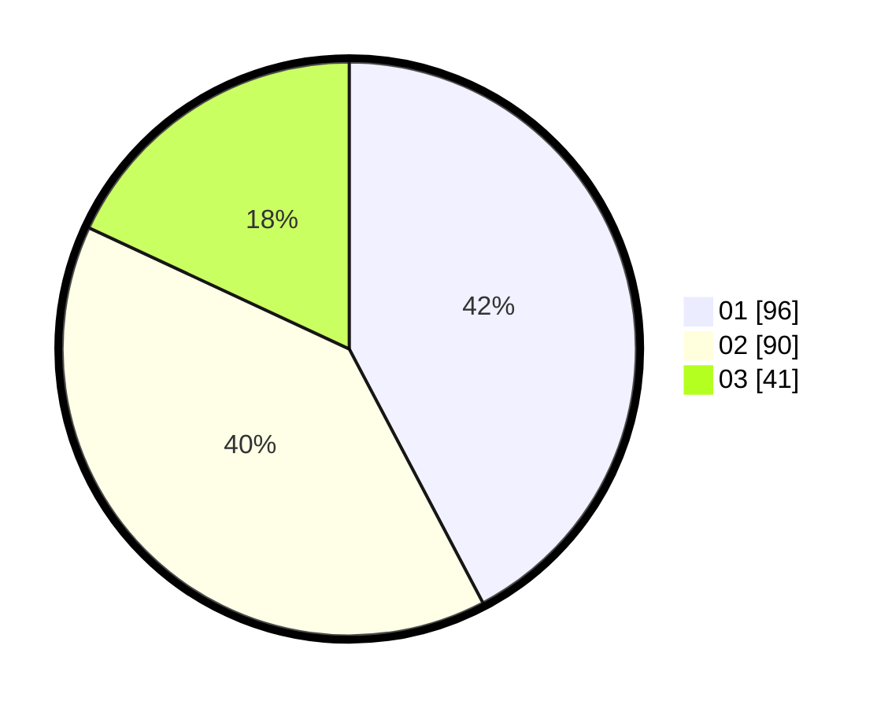

# Hasil

Hasil perolehan suara paslon dapat dilihat pada file paslon-01.txt, paslon-02.txt, dan paslon-03.txt.

Jika tidak ada, artinya data tersebut belum ada pada SIREKAP.

## Perolehan Suara

 * Paslon 01: **96**.
 * Paslon 02: **90**.
 * Paslon 03: **41**.

## Foto C Plano

https://sirekap-obj-formc.kpu.go.id/a38a/pemilu/ppwp/31/75/09/10/02/3175091002063-20240214-193833--c334e9c6-30b0-4558-854c-e53b4deb39b7.jpg

https://sirekap-obj-formc.kpu.go.id/a38a/pemilu/ppwp/31/75/09/10/02/3175091002063-20240214-194051--28af8b37-2136-40b7-a293-d6ac8a7a99f0.jpg

https://sirekap-obj-formc.kpu.go.id/a38a/pemilu/ppwp/31/75/09/10/02/3175091002063-20240214-194409--62ed1f09-def6-4426-8096-261eb3ab057c.jpg

## DATA PEMILIH TETAP

Jumlah pemilih dalam DPT: **282**.
 * L: **136**.
 * P: **146**.

## DATA PENGGUNA HAK PILIH

Jumlah pengguna hak pilih dalam DPT: **232**.
 * L: **107**.
 * P: **225**.

Jumlah pengguna hak pilih dalam DPTb: **1**.
 * L: **7**.
 * P: **0**.

Jumlah pengguna hak pilih dalam DPK: **0**.
 * L: **0**.
 * P: **0**.

Jumlah pengguna hak pilih: **233**.
 * L: **108**.
 * P: **125**.

## JUMLAH SUARA SAH DAN TIDAK SAH

JUMLAH SELURUH SUARA SAH: **227**.

JUMLAH SUARA TIDAK SAH: **6**.

JUMLAH SELURUH SUARA SAH DAN SUARA TIDAK SAH: **233**.
