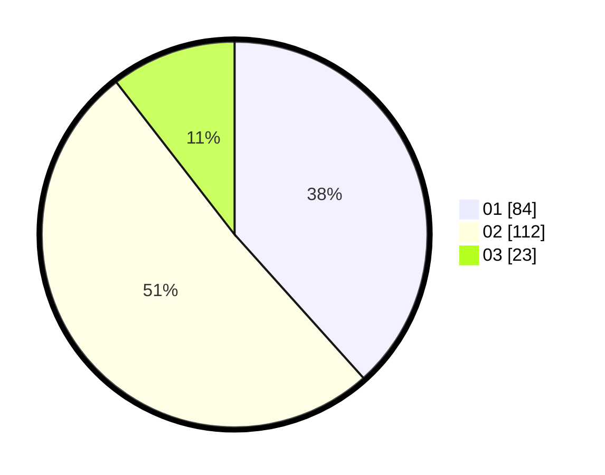

# Hasil

Hasil perolehan suara paslon dapat dilihat pada file paslon-01.txt, paslon-02.txt, dan paslon-03.txt.

Jika tidak ada, artinya data tersebut belum ada pada SIREKAP.

## Perolehan Suara

 * Paslon 01: **84**.
 * Paslon 02: **112**.
 * Paslon 03: **23**.

## Foto C Plano

https://sirekap-obj-formc.kpu.go.id/b1ff/pemilu/ppwp/31/75/09/10/02/3175091002067-20240214-195549--f574e5fe-b2d9-45ef-a5c4-3b9a81ee5e48.jpg

https://sirekap-obj-formc.kpu.go.id/b1ff/pemilu/ppwp/31/75/09/10/02/3175091002067-20240214-155005--9e72337e-98b5-4072-bd8f-fb51444ad365.jpg

https://sirekap-obj-formc.kpu.go.id/b1ff/pemilu/ppwp/31/75/09/10/02/3175091002067-20240214-155742--c803a85b-7a67-4344-bf8c-5312ea957d8f.jpg
