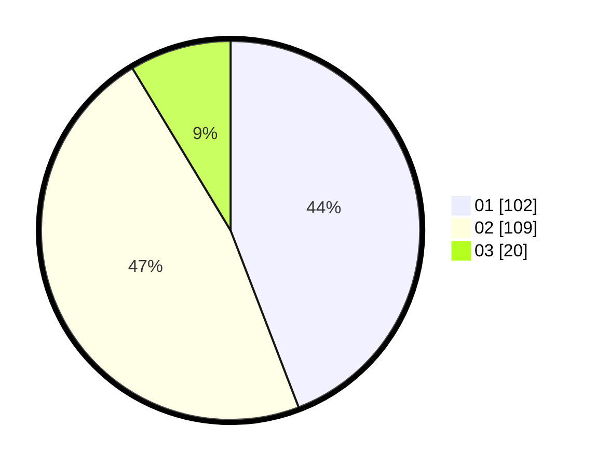

# Hasil

Hasil perolehan suara paslon dapat dilihat pada file paslon-01.txt, paslon-02.txt, dan paslon-03.txt.

Jika tidak ada, artinya data tersebut belum ada pada SIREKAP.

## Perolehan Suara

 * Paslon 01: **102**.
 * Paslon 02: **109**.
 * Paslon 03: **20**.

## Foto C Plano

https://sirekap-obj-formc.kpu.go.id/6b31/pemilu/ppwp/31/75/09/10/02/3175091002071-20240214-210856--e7ee2821-fb8a-4527-938a-9266117156db.jpg

https://sirekap-obj-formc.kpu.go.id/6b31/pemilu/ppwp/31/75/09/10/02/3175091002071-20240214-193044--c00d4857-ab02-471f-8574-a7b57ca17a57.jpg

https://sirekap-obj-formc.kpu.go.id/6b31/pemilu/ppwp/31/75/09/10/02/3175091002071-20240214-193048--82568a4b-7981-4bce-bf04-b3291842a825.jpg

## DATA PEMILIH TETAP

Jumlah pemilih dalam DPT: **281**.
 * L: **146**.
 * P: **135**.

## DATA PENGGUNA HAK PILIH

Jumlah pengguna hak pilih dalam DPT: **233**.
 * L: **114**.
 * P: **119**.

Jumlah pengguna hak pilih dalam DPTb: **0**.
 * L: **0**.
 * P: **0**.

Jumlah pengguna hak pilih dalam DPK: **0**.
 * L: **0**.
 * P: **0**.

Jumlah pengguna hak pilih: **233**.
 * L: **114**.
 * P: **119**.

## JUMLAH SUARA SAH DAN TIDAK SAH

JUMLAH SELURUH SUARA SAH: **231**.

JUMLAH SUARA TIDAK SAH: **2**.

JUMLAH SELURUH SUARA SAH DAN SUARA TIDAK SAH: **233**.
