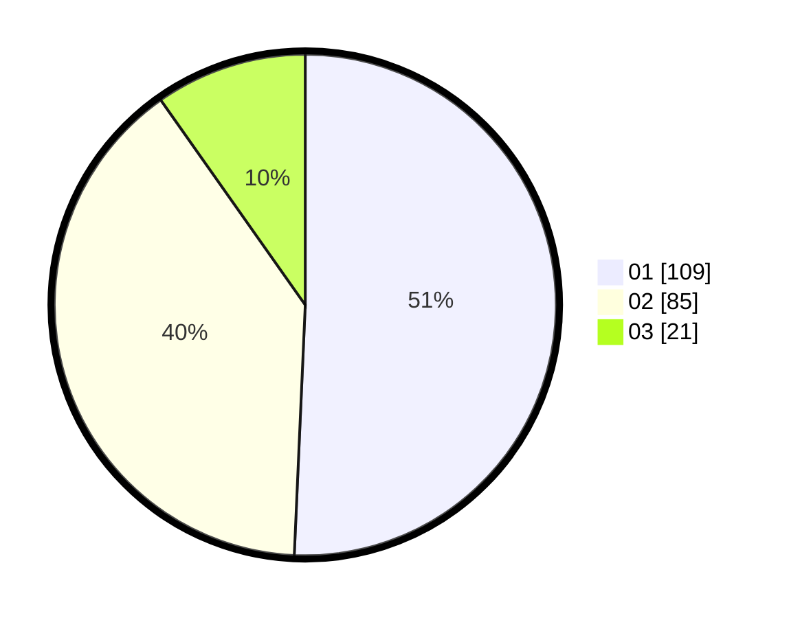

# Hasil

Hasil perolehan suara paslon dapat dilihat pada file paslon-01.txt, paslon-02.txt, dan paslon-03.txt.

Jika tidak ada, artinya data tersebut belum ada pada SIREKAP.

## Perolehan Suara

 * Paslon 01: **109**.
 * Paslon 02: **85**.
 * Paslon 03: **21**.

## Foto C Plano

https://sirekap-obj-formc.kpu.go.id/5961/pemilu/ppwp/31/75/09/10/02/3175091002077-20240216-145015--61500bfb-56d8-4598-8877-d95cd05eec5a.jpg

https://sirekap-obj-formc.kpu.go.id/5961/pemilu/ppwp/31/75/09/10/02/3175091002077-20240216-150506--79171dde-8ab7-4613-8b06-20be842b613b.jpg

https://sirekap-obj-formc.kpu.go.id/5961/pemilu/ppwp/31/75/09/10/02/3175091002077-20240216-151956--5aacd781-9f7a-4071-97b5-2cd7145b7eb3.jpg

## DATA PEMILIH TETAP

Jumlah pemilih dalam DPT: **275**.
 * L: **129**.
 * P: **146**.

## DATA PENGGUNA HAK PILIH

Jumlah pengguna hak pilih dalam DPT: **219**.
 * L: **99**.
 * P: **120**.

Jumlah pengguna hak pilih dalam DPTb: **0**.
 * L: **0**.
 * P: **0**.

Jumlah pengguna hak pilih dalam DPK: **0**.
 * L: **0**.
 * P: **0**.

Jumlah pengguna hak pilih: **219**.
 * L: **99**.
 * P: **120**.

## JUMLAH SUARA SAH DAN TIDAK SAH

JUMLAH SELURUH SUARA SAH: **215**.

JUMLAH SUARA TIDAK SAH: **4**.

JUMLAH SELURUH SUARA SAH DAN SUARA TIDAK SAH: **219**.
