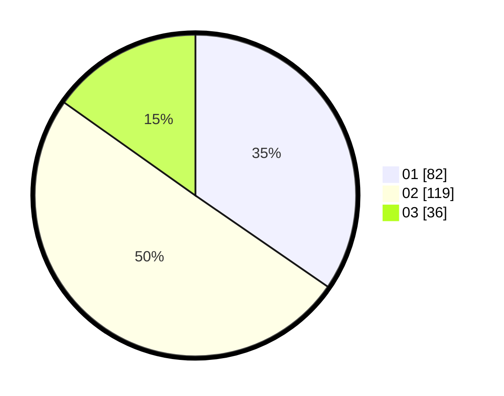

# Hasil

Hasil perolehan suara paslon dapat dilihat pada file paslon-01.txt, paslon-02.txt, dan paslon-03.txt.

Jika tidak ada, artinya data tersebut belum ada pada SIREKAP.

## Perolehan Suara

 * Paslon 01: **82**.
 * Paslon 02: **119**.
 * Paslon 03: **36**.

## Foto C Plano

https://sirekap-obj-formc.kpu.go.id/65be/pemilu/ppwp/31/75/09/10/02/3175091002079-20240214-155644--c000f93d-1aef-4519-b8aa-7e10d7513092.jpg

https://sirekap-obj-formc.kpu.go.id/65be/pemilu/ppwp/31/75/09/10/02/3175091002079-20240214-202706--c0f4b9cc-0fcc-4d00-9c3b-b8f4e60e808b.jpg

https://sirekap-obj-formc.kpu.go.id/65be/pemilu/ppwp/31/75/09/10/02/3175091002079-20240214-155921--b8c6786d-dc28-4d5b-95bc-5088e71e606b.jpg

## DATA PEMILIH TETAP

Jumlah pemilih dalam DPT: **272**.
 * L: **130**.
 * P: **142**.

## DATA PENGGUNA HAK PILIH

Jumlah pengguna hak pilih dalam DPT: **235**.
 * L: **108**.
 * P: **127**.

Jumlah pengguna hak pilih dalam DPTb: **3**.
 * L: **2**.
 * P: **1**.

Jumlah pengguna hak pilih dalam DPK: **5**.
 * L: **3**.
 * P: **2**.

Jumlah pengguna hak pilih: **243**.
 * L: **113**.
 * P: **130**.

## JUMLAH SUARA SAH DAN TIDAK SAH

JUMLAH SELURUH SUARA SAH: **237**.

JUMLAH SUARA TIDAK SAH: **6**.

JUMLAH SELURUH SUARA SAH DAN SUARA TIDAK SAH: **243**.
